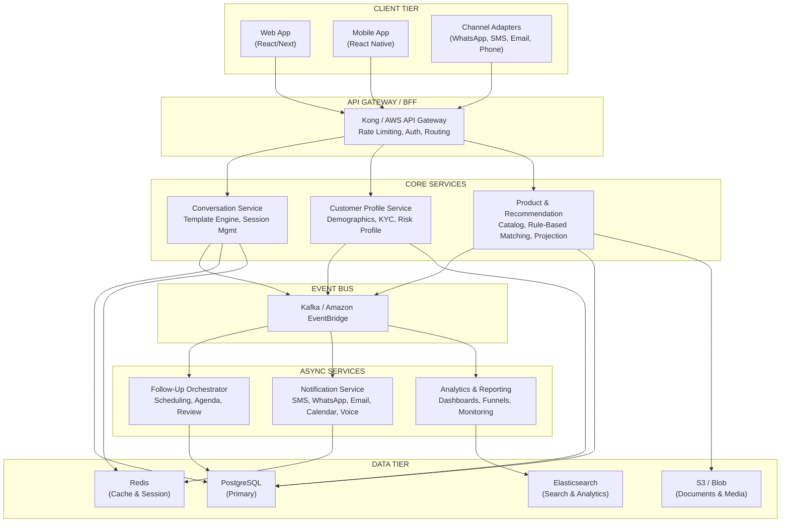
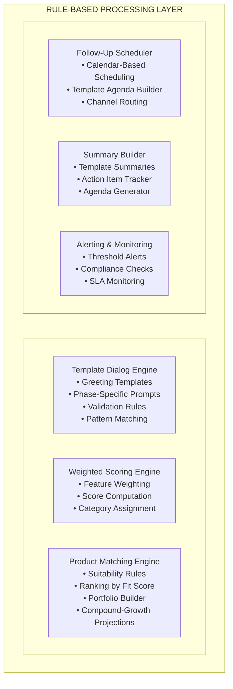
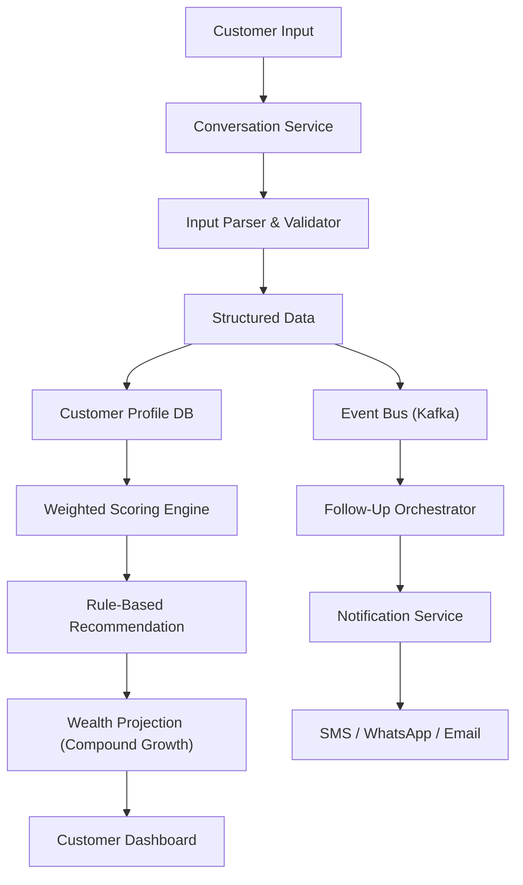
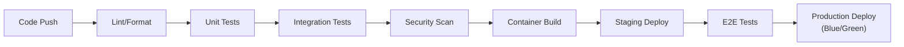

# Relationship Manager — Architecture Document (Non-AI Version)

> **Version:** 2.0 (Non-AI)
> **Date:** 2026-05-03
> **Status:** Proposed — Awaiting Review

---

## Table of Contents

1. [Executive Summary](#1-executive-summary)
2. [Business Context](#2-business-context)
3. [System Overview](#3-system-overview)
4. [Architecture Principles](#4-architecture-principles)
5. [Component Architecture](#5-component-architecture)
6. [Rule-Based Processing Architecture](#6-rule-based-processing-architecture)
7. [Security Architecture](#7-security-architecture)
8. [Data Architecture](#8-data-architecture)
9. [Integration Architecture](#9-integration-architecture)
10. [Cross-Cutting Concerns](#10-cross-cutting-concerns)

---

## 1. Executive Summary

The **Relationship Manager (RM)** platform is a conversational, rule-driven banking application that engages customers — both anonymous and authenticated — through structured, multi-channel conversations. The platform captures customer financial profiles, builds risk assessments using weighted scoring algorithms, generates wealth portfolio projections using deterministic models, and orchestrates periodic follow-ups across SMS, WhatsApp, Email, and Phone channels.

The system is designed as an **event-driven microservices architecture** deployed on cloud infrastructure, capable of serving **500,000 registered users** with **70,000–100,000 daily active interactions**, and elastic enough to scale beyond those thresholds.

---

## 2. Business Context

### 2.1 Problem Statement

Banks need a scalable, structured way to:
- Acquire new customers through guided digital conversations
- Understand customer financial profiles and risk appetite
- Recommend suitable banking and investment products
- Maintain ongoing relationships through periodic, multi-channel follow-ups
- Automate repetitive advisory tasks while maintaining a professional experience

### 2.2 Key Business Capabilities

| Capability | Description |
|---|---|
| **Customer Onboarding** | Guided conversational intake of demographics, income, investments, and retirement goals |
| **Risk Profiling** | Weighted scoring-based assessment of risk tolerance and investment suitability |
| **Product Recommendation** | Rule-based matching of customer profiles to banking/investment products |
| **Wealth Projection** | Deterministic compound-growth modelling based on customer inputs and asset returns |
| **Follow-Up Orchestration** | Scheduling and executing periodic reviews across chosen channels |
| **Reminder Service** | Multi-channel nudges (SMS, WhatsApp, Calendar, Email) |
| **Conversation Continuity** | Seamless continuation from previous interactions |

### 2.3 User Personas

| Persona | Description |
|---|---|
| **Anonymous Visitor** | Lands on the platform, explores without logging in; may convert to a registered user |
| **Registered Customer** | Authenticated user with a full profile, active conversations, and scheduled follow-ups |
| **Relationship Manager (Human)** | Bank staff who can review system recommendations and intervene when needed |
| **System Admin** | Manages products, conversation templates, and system configuration |

---

## 3. System Overview

### 3.1 Architectural Style

**Event-Driven Microservices** with a **Rule-Based Conversation Engine**

### 3.2 Key Architectural Decisions

| Decision | Rationale |
|---|---|
| **Microservices over Monolith** | Independent scaling of conversation engine vs. notification services; team autonomy |
| **Event-Driven Communication** | Decoupled services; natural fit for async operations (notifications, scheduling) |
| **Rule-Based Dialog Engine** | Template-driven conversation with pattern matching; deterministic, testable, no external API dependency |
| **Multi-Channel Abstraction** | Single conversation model adapts to SMS, WhatsApp, Web, Voice — no channel-specific logic in core |
| **CQRS for Read/Write** | High read-to-write ratio (dashboards, analytics) benefits from separated models |
| **API Gateway** | Centralized auth, rate limiting, routing; simplifies client integration |

---

## 4. Architecture Principles

| # | Principle | Description |
|---|---|---|
| 1 | **Cloud-Native** | All services containerized (Docker), orchestrated (Kubernetes), and cloud-agnostic |
| 2 | **API-First** | All inter-service and external communication via well-defined REST/gRPC APIs |
| 3 | **Event-Driven** | Asynchronous event propagation for loose coupling and resilience |
| 4 | **Security by Design** | Zero-trust networking, encryption at rest and in transit, PII handling compliant with banking regulations |
| 5 | **Elastic Scalability** | Horizontal pod autoscaling (HPA) and cluster autoscaling for burst traffic |
| 6 | **Deterministic Processing** | Rule-based scoring, template-driven conversations, and formula-based projections — no external AI dependencies |
| 7 | **Observability** | Distributed tracing, structured logging, and metrics for all services |
| 8 | **Resilience** | Circuit breakers, retries, bulkheads, and graceful degradation |
| 9 | **Data Privacy** | GDPR/PCI-DSS compliant; PII encrypted, consent-managed, right-to-erasure supported |
| 10 | **Progressive Engagement** | Anonymous users can interact; data persists and merges upon registration |

---

## 5. Component Architecture

### 5.1 Conversation Service

The heart of the platform. Manages all customer interactions.

**Responsibilities:**
- Manage conversation sessions (anonymous and authenticated)
- Drive the conversational flow using a template-based dialog engine
- Extract structured data from customer inputs via pattern matching and form-based collection
- Maintain conversation state and context across sessions
- Hand off to human RM when input is ambiguous or customer requests it

**Sub-components:**

| Component | Technology | Purpose |
|---|---|---|
| Dialog Engine | Template Engine + State Machine | Drives conversation flow using predefined templates per phase |
| Session Manager | Redis + PostgreSQL | Manages active sessions and persists history |
| Input Parser | Regex + Validation Rules | Pattern matching for entity extraction (name, phone, email, amounts) |
| Flow Orchestrator | Custom State Machine | Manages conversation phases (greeting → data collection → profiling → recommendation) |
| Human Handoff | WebSocket + Queue | Routes to human RM when input is unclear or customer requests it |

### 5.2 Customer Profile Service

Manages all customer data and financial profiles.

**Responsibilities:**
- Store and manage customer demographics
- Maintain financial profile (income, investments, savings)
- Store risk profile assessment results
- Handle anonymous-to-authenticated profile merging
- Enforce data privacy and consent management

### 5.3 Product & Recommendation Service

Rule-based product matching and wealth projection.

**Responsibilities:**
- Maintain product catalog (savings accounts, FDs, mutual funds, insurance, etc.)
- Match customer risk profiles to suitable products using suitability rules
- Generate wealth portfolio projections using deterministic compound-growth formulas
- Track product performance and update recommendations

**Processing Components:**
- **Risk Assessment Engine**: Classifies customers into risk categories (Conservative, Moderate, Aggressive, Very Aggressive) using a weighted scoring algorithm based on age, income, goals, and stated preferences
- **Recommendation Engine**: Rule-based suitability filtering + product ranking by fit score
- **Wealth Projection Engine**: Deterministic compound-growth formula for portfolio projections

### 5.4 Follow-Up Orchestrator

Schedules and manages periodic customer reviews.

**Responsibilities:**
- Schedule follow-ups based on customer preferences and RM availability
- Build agendas from previous conversation data and action item status
- Track action items for both RM and customer
- Trigger reminders via the Notification Service

### 5.5 Notification Service

Multi-channel communication gateway.

**Responsibilities:**
- Route notifications to the customer's preferred channel
- Manage provider integrations (Twilio for SMS/Voice, WhatsApp Business API, SendGrid for Email)
- Handle delivery receipts and retry logic
- Manage calendar integrations (Google Calendar, Outlook)

### 5.6 Analytics & Reporting Service

Business intelligence and system monitoring.

**Responsibilities:**
- Track conversion funnels (visitor → conversation → profile → product)
- Monitor system performance (latency, throughput, error rates)
- Generate RM performance dashboards
- Compliance and audit reporting

---

## 6. Rule-Based Processing Architecture

### 6.1 Processing Flows Overview

### 6.2 Processing Flow Details

#### Flow 1: Template Dialog Engine
- **Purpose**: Drive structured, multi-turn conversations to collect customer data
- **Approach**: Phase-specific templates with branching logic and validation rules
- **Input Parsing**: Regex-based entity extraction (names, phone numbers, email, currency amounts, age)
- **Validation**: Format checking, range validation, confirmation prompts
- **Fallback**: Clarification prompts when input is ambiguous; handoff to human RM after 2 failed attempts

#### Flow 2: Weighted Scoring Engine
- **Purpose**: Classify customers into risk categories based on collected data
- **Approach**: Multi-factor weighted scoring algorithm with configurable weights
- **Inputs**: Age group, income, investments, savings, retirement goals, stated preferences
- **Output**: Risk score (1-10) + Category (Conservative / Moderate / Aggressive / Very Aggressive)
- **Recalibration**: Weights reviewed quarterly by product team

#### Flow 3: Product Recommendation Engine
- **Purpose**: Match customer profiles to suitable products
- **Approach**: Rule-based suitability filtering + weighted ranking
- **Rules**: Regulatory suitability rules (e.g., don't recommend high-risk products to conservative profiles), age eligibility, minimum investment thresholds
- **Ranking**: Products scored by fit (risk alignment, return potential, tax benefits)

#### Flow 4: Wealth Projection Engine
- **Purpose**: Project portfolio growth over time
- **Model**: Deterministic compound-growth formula with asset-class-specific expected returns
- **Inputs**: Current savings, monthly contribution capacity, risk tolerance, target retirement age/amount
- **Output**: Projected portfolio value (conservative, expected, optimistic) with year-by-year breakdown

#### Flow 5: Follow-Up Scheduler
- **Purpose**: Manage follow-up timing, channel, and agenda
- **Approach**: Calendar-based scheduling with customer preference rules
- **Agenda**: Template-based agenda built from previous conversation data and action items

#### Flow 6: Summary Builder
- **Purpose**: Generate briefs for follow-up conversations
- **Approach**: Template-based summaries from stored conversation data
- **Output**: Previous conversation summary, action items status, agenda for next interaction

---

## 7. Security Architecture

### 7.1 Authentication & Authorization

| Layer | Mechanism |
|---|---|
| **Anonymous Sessions** | Ephemeral session tokens (JWT, short-lived) with limited scope |
| **User Authentication** | OAuth 2.0 / OpenID Connect with MFA support |
| **Service-to-Service** | mTLS + API keys within the service mesh |
| **Human RM Access** | Role-based access control (RBAC) with bank SSO integration |

### 7.2 Data Protection

| Concern | Solution |
|---|---|
| **PII Encryption** | AES-256 encryption at rest; TLS 1.3 in transit |
| **Data Masking** | Dynamic masking for non-privileged access (e.g., phone: ***-***-1234) |
| **Consent Management** | Explicit opt-in for data collection; granular consent per data type |
| **Right to Erasure** | Automated PII purge pipeline triggered by customer request |
| **Audit Trail** | Immutable audit log for all data access and modifications |
| **PCI-DSS Compliance** | No storage of card details; tokenized references only |

### 7.3 API Security

- Rate limiting per client (anonymous: 30 req/min; authenticated: 120 req/min)
- WAF (Web Application Firewall) at API Gateway level
- Input validation and sanitization at every service boundary
- CORS configured per-environment

---

## 8. Data Architecture

### 8.1 Data Stores

| Store | Technology | Purpose | Data |
|---|---|---|---|
| **Primary DB** | PostgreSQL (Aurora) | Transactional data | Customers, conversations, profiles, products |
| **Cache** | Redis Cluster | Session, cache, rate limits | Active sessions, conversation context, API cache |
| **Document Store** | S3 / Azure Blob | Documents and media | KYC documents, conversation transcripts, reports |
| **Search & Analytics** | Elasticsearch | Full-text search, analytics | Conversation logs, product search, audit trails |
| **Event Store** | Kafka (with retention) | Event sourcing | All domain events for replay and analytics |

### 8.2 Data Flow

---

## 9. Integration Architecture

### 9.1 External Integrations

| Integration | Provider | Purpose | Protocol |
|---|---|---|---|
| **SMS** | Twilio | SMS notifications and OTP | REST API |
| **WhatsApp** | WhatsApp Business API (Meta) | Interactive messaging | REST + Webhook |
| **Email** | SendGrid / Amazon SES | Email notifications | REST API |
| **Voice/IVR** | Twilio Voice | Phone-based follow-ups | REST + WebSocket |
| **Calendar** | Google Calendar / Microsoft Graph | Meeting scheduling and reminders | REST (OAuth) |
| **Market Data** | Bloomberg / Alpha Vantage | Real-time and historical market data | REST / WebSocket |
| **KYC/AML** | Bank's internal system | Identity verification | REST / SOAP |
| **Core Banking** | Bank's CBS | Account and product data | REST / ISO 20022 |

### 9.2 Integration Patterns

- **Synchronous**: API Gateway → Service (for real-time conversations)
- **Asynchronous**: Event Bus → Consumer (for notifications, scheduling, analytics)
- **Webhook**: External → API Gateway (for delivery receipts, WhatsApp messages)
- **Polling**: Follow-Up Orchestrator checks scheduled tasks every minute

---

## 10. Cross-Cutting Concerns

### 10.1 Observability

| Concern | Tool | Purpose |
|---|---|---|
| **Distributed Tracing** | Jaeger / AWS X-Ray | End-to-end request tracing across services |
| **Logging** | ELK Stack (Elasticsearch, Logstash, Kibana) | Centralized structured logging |
| **Metrics** | Prometheus + Grafana | Service health, latency, throughput dashboards |
| **Alerting** | PagerDuty / CloudWatch Alarms | SLA breach and error rate alerting |

### 10.2 Resilience Patterns

| Pattern | Implementation |
|---|---|
| **Circuit Breaker** | Resilience4j on all inter-service calls |
| **Retry with Backoff** | Exponential backoff for transient failures |
| **Bulkhead** | Thread pool isolation per downstream dependency |
| **Timeout** | Configurable per-call (default 5s for sync calls) |
| **Dead Letter Queue** | Failed events routed to DLQ for manual inspection |
| **Graceful Degradation** | If a service is unavailable, serve cached data or queue requests |

### 10.3 CI/CD Pipeline

- **Infrastructure as Code**: Terraform for cloud resources
- **GitOps**: ArgoCD for Kubernetes deployments
- **Feature Flags**: LaunchDarkly / Flagsmith for progressive rollouts

---

*Next: See [02-high-level-design.md](./02-high-level-design.md) for detailed service decomposition and data flows.*
