# Relationship Manager — High-Level Design (HLD)

> **Version:** 1.0 (Draft)
> **Date:** 2026-05-03
> **Status:** Proposed — Awaiting Review

---

## Table of Contents

1. [Service Decomposition](#1-service-decomposition)
2. [Technology Stack](#2-technology-stack)
3. [Communication Patterns](#3-communication-patterns)
4. [Data Flow Diagrams](#4-data-flow-diagrams)
5. [Conversation Flow Design](#5-conversation-flow-design)
6. [Multi-Channel Architecture](#6-multi-channel-architecture)
7. [Session Management](#7-session-management)
8. [AI Pipeline Design](#8-ai-pipeline-design)
9. [Deployment Architecture](#9-deployment-architecture)
10. [Non-Functional Requirements](#10-non-functional-requirements)

---

## 1. Service Decomposition

### 1.1 Microservice Inventory

| # | Service | Domain | Scaling Profile | Database |
|---|---|---|---|---|
| 1 | **API Gateway** | Edge | High — handles all traffic | — (stateless) |
| 2 | **Auth Service** | Identity | Medium — login/token refresh | PostgreSQL (shared) |
| 3 | **Conversation Service** | Core | High — all chat interactions | PostgreSQL + Redis |
| 4 | **Customer Profile Service** | Core | Medium — profile CRUD | PostgreSQL |
| 5 | **Risk Profiling Service** | AI | Medium — on-demand computation | PostgreSQL + ML Store |
| 6 | **Product Catalog Service** | Domain | Low — admin-managed | PostgreSQL |
| 7 | **Recommendation Service** | AI | Medium — triggered per profile | Redis (cache) |
| 8 | **Wealth Projection Service** | AI | Low-Medium — compute-heavy | Redis (cache) |
| 9 | **Follow-Up Orchestrator** | Workflow | Medium — scheduled tasks | PostgreSQL |
| 10 | **Notification Service** | Integration | High — multi-channel delivery | PostgreSQL + Redis |
| 11 | **Reminder Service** | Workflow | Medium — cron-triggered | PostgreSQL |
| 12 | **Analytics Service** | Reporting | Low-Medium — async processing | Elasticsearch |
| 13 | **Admin Service** | Operations | Low — staff-facing | PostgreSQL (shared) |

### 1.2 Service Dependency Map

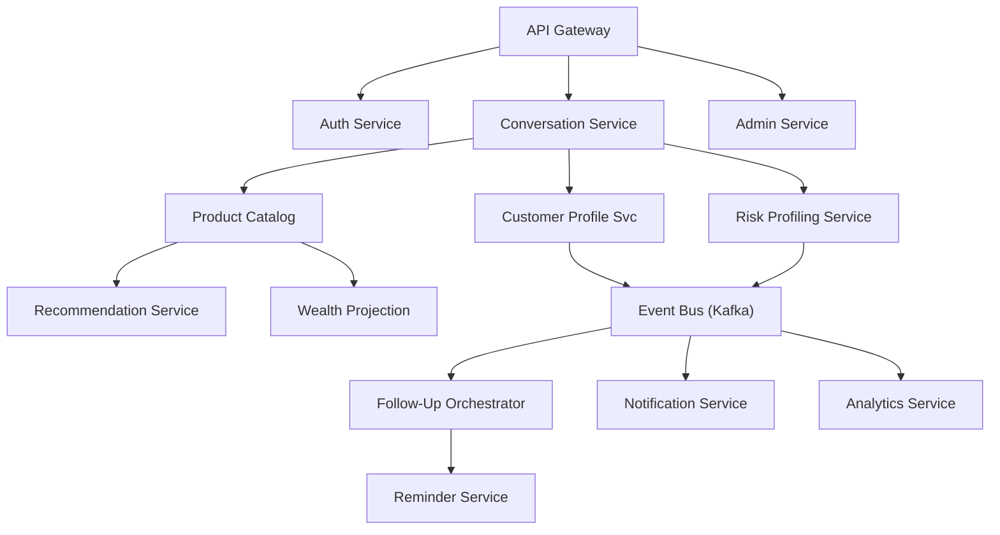

---

## 2. Technology Stack

### 2.1 Backend Services

| Layer | Technology | Justification |
|---|---|---|
| **Language** | Java 17 / Kotlin (Spring Boot 3) | Enterprise-grade, team familiarity, rich ecosystem |
| **Framework** | Spring Boot 3 + Spring WebFlux | Reactive support for high-concurrency conversation handling |
| **API Style** | REST (external) + gRPC (internal) | REST for clients; gRPC for low-latency inter-service calls |
| **GraphQL** | Netflix DGS Framework | Flexible queries for frontend dashboard data |
| **ORM / Data Access** | MyBatis (existing pattern) + Spring Data JPA | MyBatis for complex queries; JPA for simple CRUD |
| **Event Streaming** | Apache Kafka (MSK) | Durable, high-throughput event bus |
| **Caching** | Redis Cluster (ElastiCache) | Session store, conversation context, API caching |
| **Scheduling** | Spring Scheduler + Quartz | Follow-up and reminder scheduling |
| **AI Orchestration** | LangChain4j / Spring AI | Java-native LLM orchestration |

### 2.2 Frontend

| Layer | Technology | Justification |
|---|---|---|
| **Web Framework** | Next.js 14 (App Router) + React 18 | SSR for SEO, RSC for performance |
| **UI Library** | Shadcn/UI + Tailwind CSS | Rapid development, consistent banking UI |
| **State Management** | Zustand + React Query (TanStack) | Lightweight global state + server state caching |
| **Chat UI** | Custom WebSocket-based chat component | Real-time conversation experience |
| **Mobile** | React Native | Code sharing with web; single team for both platforms |
| **Charts** | Recharts / D3.js | Wealth projection visualizations |

### 2.3 Infrastructure

| Layer | Technology | Justification |
|---|---|---|
| **Cloud** | AWS (primary) | Mature banking-grade services, compliance certifications |
| **Container Orchestration** | Amazon EKS (Kubernetes) | Elastic scaling, self-healing, rolling deployments |
| **Service Mesh** | Istio | mTLS, traffic management, observability |
| **CI/CD** | GitHub Actions + ArgoCD | GitOps-based deployments |
| **IaC** | Terraform + Helm | Reproducible infrastructure |
| **Secrets** | AWS Secrets Manager + HashiCorp Vault | Centralized secret management |
| **CDN** | CloudFront | Static asset delivery, edge caching |
| **DNS** | Route 53 | DNS management with health checks |

### 2.4 AI / ML

| Layer | Technology | Justification |
|---|---|---|
| **LLM** | Azure OpenAI (GPT-4o) / Anthropic Claude | Enterprise SLA, data privacy agreements |
| **Orchestration** | LangChain4j + Spring AI | Java-native LLM orchestration |
| **Vector DB** | Pinecone / pgvector | RAG for product knowledge retrieval |
| **ML Training** | Amazon SageMaker | Risk model training and hosting |
| **Feature Store** | Amazon SageMaker Feature Store | Real-time feature serving |
| **Model Registry** | MLflow | Model versioning and experiment tracking |

---

## 3. Communication Patterns

### 3.1 Synchronous (Request-Response)

Used for real-time, latency-sensitive interactions.

| Caller | Callee | Protocol | Use Case |
|---|---|---|---|
| Client → API Gateway | REST/HTTPS | All client requests |
| API GW → Auth Service | gRPC | Token validation |
| API GW → Conversation Service | REST + WebSocket | Chat messages |
| Conversation Svc → Customer Profile Svc | gRPC | Profile lookup during conversation |
| Conversation Svc → LLM Provider | REST | AI response generation |
| Recommendation Svc → Product Catalog Svc | gRPC | Product details lookup |

### 3.2 Asynchronous (Event-Driven)

Used for decoupled, eventually-consistent operations.

| Event | Producer | Consumer(s) | Topic |
|---|---|---|---|
| `conversation.completed` | Conversation Svc | Profile Svc, Analytics Svc | `rm.conversation.events` |
| `profile.updated` | Profile Svc | Risk Svc, Recommendation Svc | `rm.profile.events` |
| `risk.assessed` | Risk Svc | Recommendation Svc, Analytics Svc | `rm.risk.events` |
| `recommendation.generated` | Recommendation Svc | Notification Svc, Analytics Svc | `rm.recommendation.events` |
| `followup.scheduled` | Follow-Up Orchestrator | Reminder Svc, Notification Svc | `rm.followup.events` |
| `followup.due` | Reminder Svc | Notification Svc, Conversation Svc | `rm.reminder.events` |
| `notification.sent` | Notification Svc | Analytics Svc | `rm.notification.events` |
| `notification.delivered` | External Webhook | Notification Svc, Analytics Svc | `rm.delivery.events` |

### 3.3 WebSocket (Real-Time)

| Channel | Purpose |
|---|---|
| `/ws/chat/{sessionId}` | Real-time conversation between customer and RM (AI or human) |
| `/ws/notifications/{userId}` | Real-time in-app notifications |
| `/ws/dashboard/{rmId}` | Live dashboard updates for human RMs |

---

## 4. Data Flow Diagrams

### 4.1 New Customer Conversation Flow

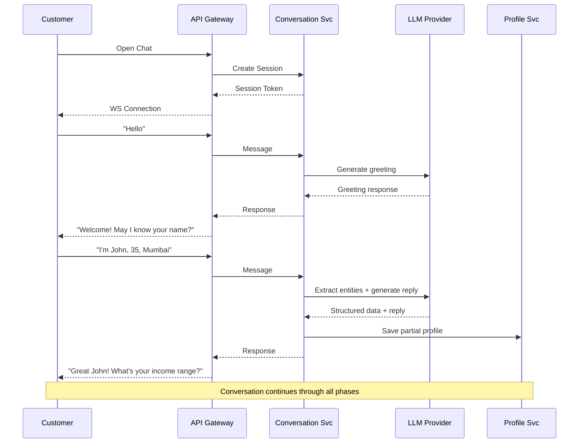

### 4.2 Risk Profiling & Recommendation Flow

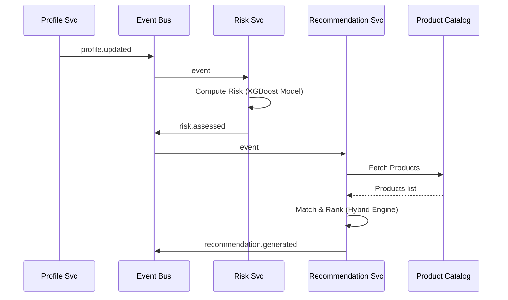

### 4.3 Follow-Up Scheduling Flow

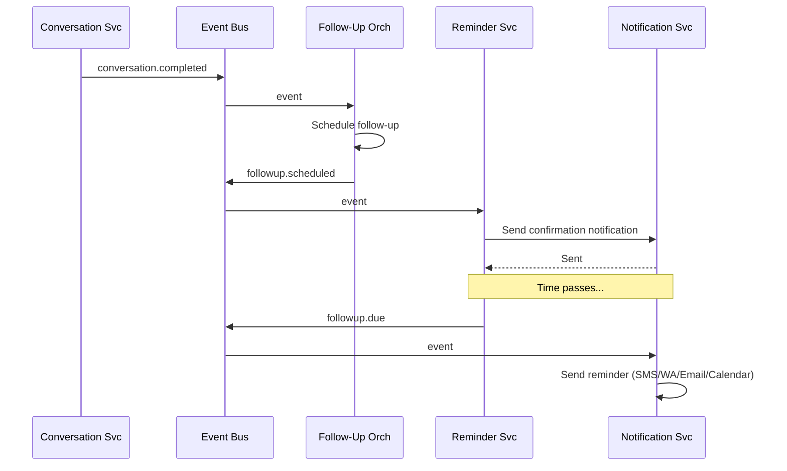

---

## 5. Conversation Flow Design

### 5.1 Conversation Phases

The RM guides the customer through a structured but natural conversation across these phases:

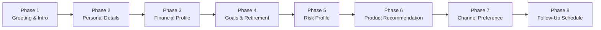

### 5.2 Phase Details

| Phase | Data Collected | AI Role |
|---|---|---|
| **1. Greeting** | — | Warm greeting, set conversational tone |
| **2. Personal Details** | Name, age group (20-30/30-40/40-50/50+), location, phone, email | Entity extraction from natural language |
| **3. Financial Profile** | Income source (salaried/business/professional/self-employed/student/retired), income range (60-70k/70-80k/80-100k/100-150k/150k+), current investments, savings | Guided data capture with clarification |
| **4. Goals & Retirement** | Desired retirement corpus, target retirement age | Contextual suggestions based on age group |
| **5. Risk Assessment** | Derived from all above + additional preference questions | ML model scoring + LLM explanation |
| **6. Product Recommendation** | — | AI-matched products + wealth projection chart |
| **7. Channel Preference** | Preferred communication mode (SMS/WhatsApp/Email/Phone) | Offer options, confirm selection |
| **8. Follow-Up Scheduling** | Follow-up frequency, preferred times | Schedule creation + confirmation |

### 5.3 Conversation State Machine

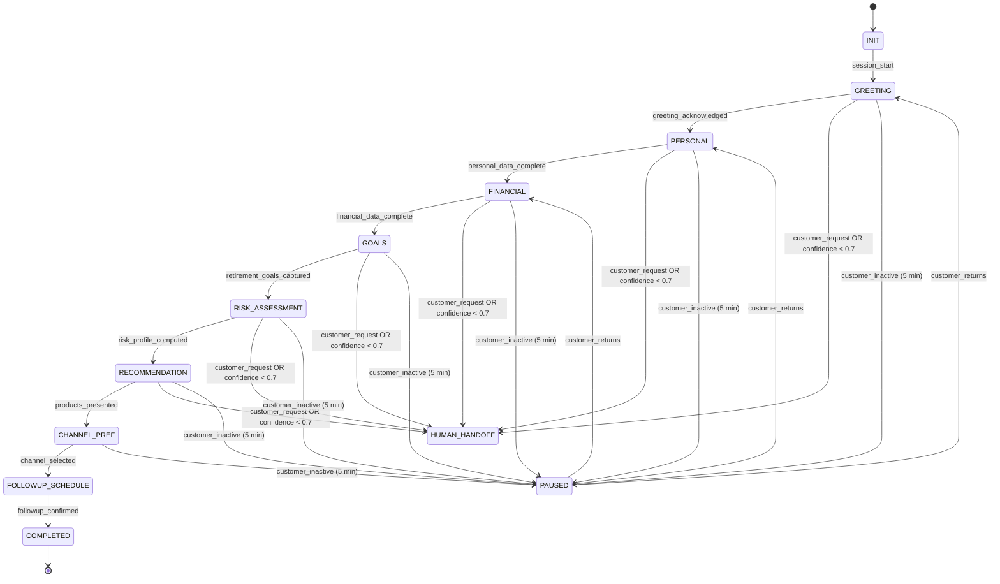

---

## 6. Multi-Channel Architecture

### 6.1 Channel Abstraction Layer

All channels are unified behind a **Channel Adapter** interface:

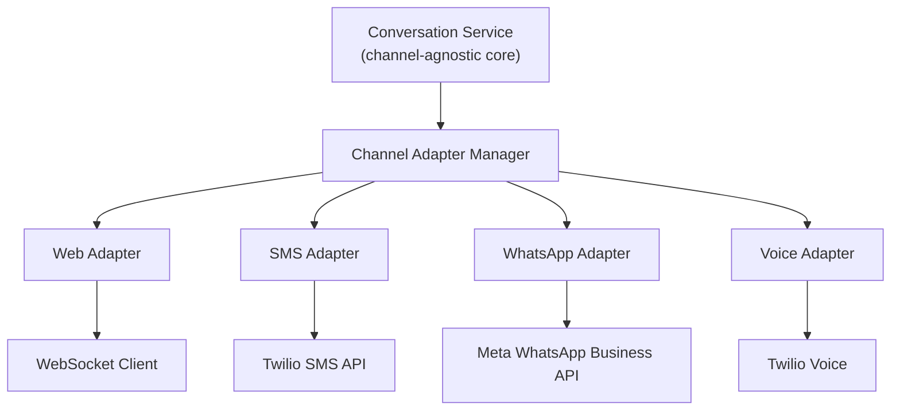

### 6.2 Channel Capabilities Matrix

| Capability | Web | Mobile | SMS | WhatsApp | Email | Phone/Voice |
|---|---|---|---|---|---|---|
| **Interactive Conversation** | Yes | Yes | Limited | Yes | No | Yes (IVR/AI) |
| **Rich Media** | Yes | Yes | No | Yes | Yes | No |
| **Charts/Graphs** | Yes | Yes | No | Image | Image | No |
| **Real-Time** | WebSocket | WebSocket | No | Near-RT | No | Yes |
| **Follow-Up Mode** | Push | Push | Text | Interactive | Text | Voice |
| **Reminder Delivery** | Push | Push | Yes | Yes | Yes | Yes |
| **Calendar Integration** | Yes | Yes | — | — | Yes | — |

### 6.3 Channel Selection Logic

For follow-ups, the customer chooses their preferred channel. The system respects this but can suggest alternatives based on engagement data:

```python
if customer.preferred_channel == SMS:
    send_text_summary()        # Brief, non-interactive
elif customer.preferred_channel == EMAIL:
    send_rich_email()          # Detailed with charts
elif customer.preferred_channel == WHATSAPP:
    send_interactive_message() # Interactive buttons, quick replies
elif customer.preferred_channel == PHONE:
    schedule_voice_call()      # AI voice or human RM call
```

---

## 7. Session Management

### 7.1 Anonymous Sessions

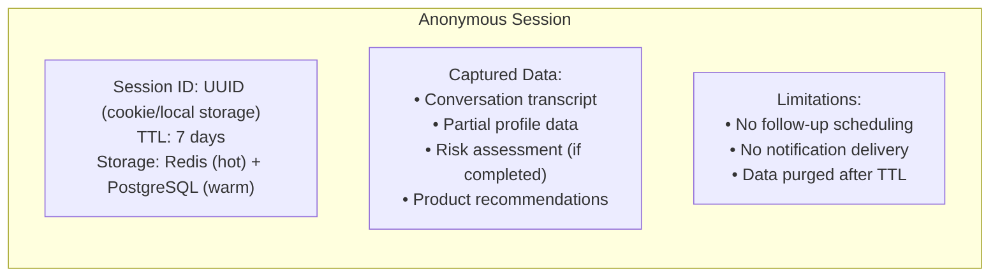

### 7.2 Session Conversion (Anonymous → Authenticated)

When an anonymous user registers or logs in:
1. Fetch anonymous session data from Redis/PostgreSQL
2. Create authenticated user record
3. Migrate conversation history and profile data to the user's permanent record
4. Delete anonymous session
5. Continue conversation seamlessly from where they left off

### 7.3 Authenticated Sessions

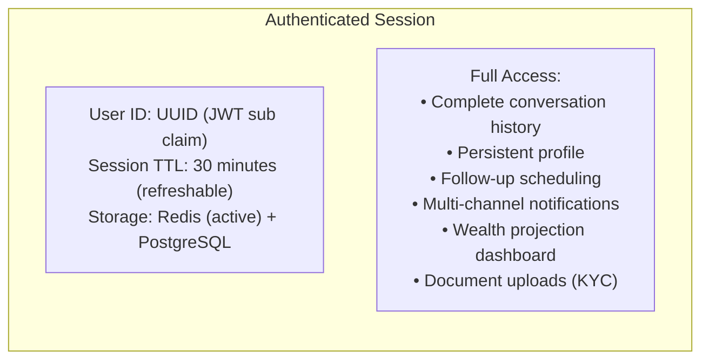

---

## 8. AI Pipeline Design

### 8.1 Conversation AI Pipeline

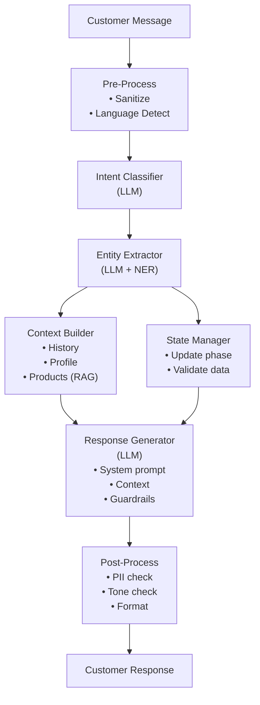

### 8.2 Risk Assessment Pipeline

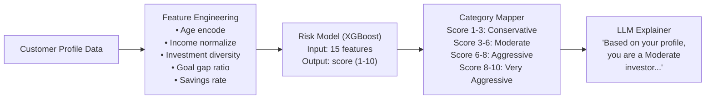

### 8.3 Recommendation Pipeline

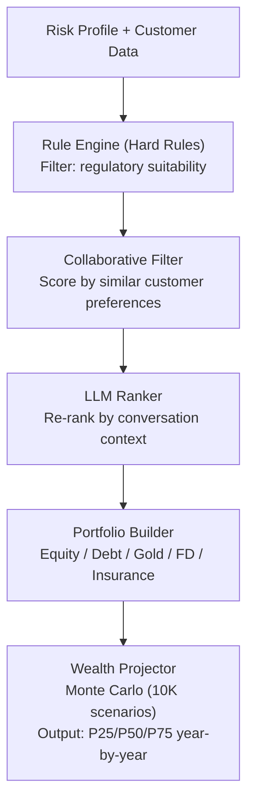

---

## 9. Deployment Architecture

### 9.1 Kubernetes Cluster Layout

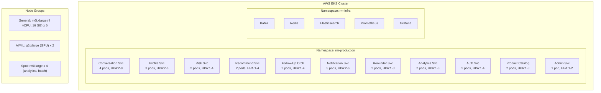

### 9.2 Multi-AZ Deployment

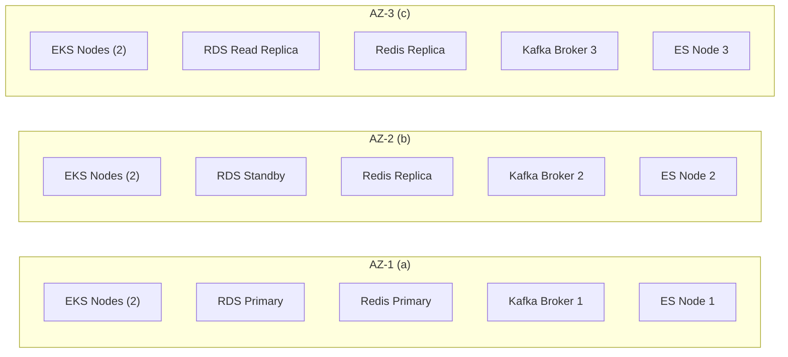

---

## 10. Non-Functional Requirements

### 10.1 Performance Targets

| Metric | Target | Measurement |
|---|---|---|
| **Chat Response Time** | < 2 seconds (P95) | From message sent to response displayed |
| **AI Inference Latency** | < 3 seconds (P95) | LLM response generation time |
| **API Response Time** | < 200ms (P95) | Non-AI REST API calls |
| **Concurrent Conversations** | 10,000 simultaneous | WebSocket connections |
| **Notification Delivery** | < 30 seconds | From trigger to channel delivery |
| **Throughput** | 500 conversations/minute | New conversation starts |

### 10.2 Availability & Reliability

| Metric | Target |
|---|---|
| **System Availability** | 99.95% (< 4.38 hours downtime/year) |
| **RTO (Recovery Time Objective)** | < 15 minutes |
| **RPO (Recovery Point Objective)** | < 1 minute (for conversation data) |
| **Error Rate** | < 0.1% for API calls |

### 10.3 Scalability Targets

| Dimension | Base | Peak | Elastic Max |
|---|---|---|---|
| **Registered Users** | 500,000 | — | Unlimited (DB sharding) |
| **Daily Active Users** | 70,000 | 100,000 | 200,000+ |
| **Concurrent Sessions** | 5,000 | 10,000 | 25,000 |
| **Messages/Day** | 1,000,000 | 2,000,000 | 5,000,000 |
| **Notifications/Day** | 200,000 | 500,000 | 1,000,000 |

### 10.4 Security & Compliance

| Requirement | Standard |
|---|---|
| **Data Encryption** | AES-256 at rest, TLS 1.3 in transit |
| **Authentication** | OAuth 2.0 / OIDC with MFA |
| **Regulatory** | RBI guidelines (India), PCI-DSS Level 2, GDPR |
| **Audit** | Full audit trail with 7-year retention |
| **Penetration Testing** | Quarterly VAPT assessments |

---

*Next: See [03-low-level-design.md](./03-low-level-design.md) for detailed API contracts, database schemas, and sequence diagrams.*
