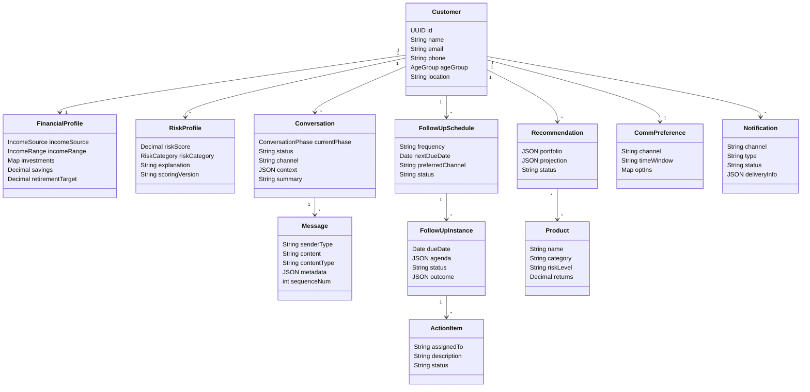
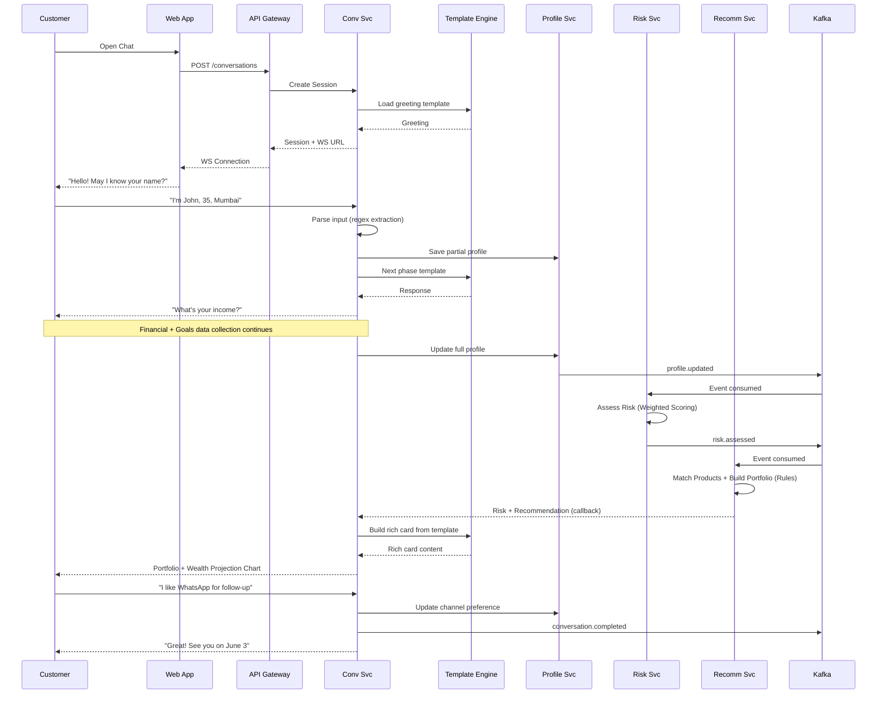
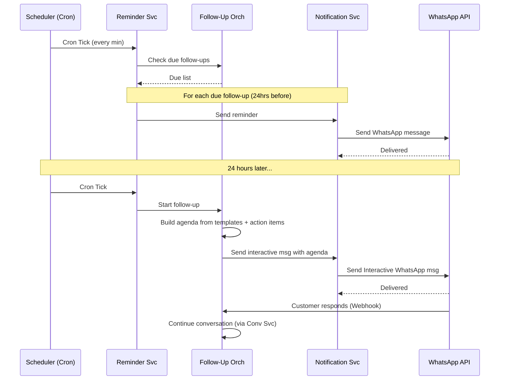

# Relationship Manager — Low-Level Design (LLD) (Non-AI Version)

> **Version:** 2.0 (Non-AI)
> **Date:** 2026-05-03
> **Status:** Proposed — Awaiting Review

---

## Table of Contents

1. [Database Schema Design](#1-database-schema-design)
2. [API Contracts](#2-api-contracts)
3. [Domain Model](#3-domain-model)
4. [Sequence Diagrams](#4-sequence-diagrams)
5. [Conversation Engine Detail](#5-conversation-engine-detail)
6. [Risk Profiling Algorithm](#6-risk-profiling-algorithm)
7. [Wealth Projection Model](#7-wealth-projection-model)
8. [Notification Routing Logic](#8-notification-routing-logic)
9. [Error Handling Strategy](#9-error-handling-strategy)

---

## 1. Database Schema Design

### 1.1 Customer Profile Service — PostgreSQL

```sql
-- ============================================================
-- CUSTOMER PROFILE SERVICE DATABASE
-- ============================================================

-- Core customer table
CREATE TABLE customers (
    id              UUID PRIMARY KEY DEFAULT gen_random_uuid(),
    external_id     VARCHAR(64) UNIQUE,              -- Bank's customer ID
    name            VARCHAR(255) NOT NULL,
    email           VARCHAR(255) UNIQUE,
    phone           VARCHAR(20),
    age_group       VARCHAR(10) NOT NULL              -- '20-30', '30-40', '40-50', '50+'
                    CHECK (age_group IN ('20-30', '30-40', '40-50', '50+')),
    location        VARCHAR(255),
    status          VARCHAR(20) DEFAULT 'ACTIVE'
                    CHECK (status IN ('ACTIVE', 'INACTIVE', 'SUSPENDED', 'DELETED')),
    is_anonymous    BOOLEAN DEFAULT FALSE,
    anonymous_session_id UUID,                        -- Link to anonymous session before conversion
    created_at      TIMESTAMPTZ DEFAULT NOW(),
    updated_at      TIMESTAMPTZ DEFAULT NOW()
);

CREATE INDEX idx_customers_email ON customers(email);
CREATE INDEX idx_customers_phone ON customers(phone);
CREATE INDEX idx_customers_status ON customers(status);
CREATE INDEX idx_customers_anonymous_session ON customers(anonymous_session_id);

-- Financial profile
CREATE TABLE financial_profiles (
    id              UUID PRIMARY KEY DEFAULT gen_random_uuid(),
    customer_id     UUID NOT NULL REFERENCES customers(id) ON DELETE CASCADE,
    income_source   VARCHAR(30) NOT NULL
                    CHECK (income_source IN ('SALARIED', 'BUSINESS', 'PROFESSIONAL', 
                           'SELF_EMPLOYED', 'STUDENT', 'RETIRED')),
    income_range    VARCHAR(20) NOT NULL
                    CHECK (income_range IN ('60-70K', '70-80K', '80-100K', '100-150K', '150K+')),
    current_investments JSONB DEFAULT '{}',           -- {"mutual_funds": 50000, "fd": 100000, ...}
    current_savings DECIMAL(15,2) DEFAULT 0,
    monthly_expenses DECIMAL(15,2),
    monthly_savings_capacity DECIMAL(15,2),
    retirement_target_amount DECIMAL(15,2),
    retirement_target_age   INTEGER,
    currency        VARCHAR(3) DEFAULT 'INR',
    created_at      TIMESTAMPTZ DEFAULT NOW(),
    updated_at      TIMESTAMPTZ DEFAULT NOW(),
    UNIQUE(customer_id)                               -- One financial profile per customer
);

CREATE INDEX idx_financial_profiles_customer ON financial_profiles(customer_id);

-- Risk profile
CREATE TABLE risk_profiles (
    id              UUID PRIMARY KEY DEFAULT gen_random_uuid(),
    customer_id     UUID NOT NULL REFERENCES customers(id) ON DELETE CASCADE,
    risk_score      DECIMAL(3,1) NOT NULL             -- 1.0 to 10.0
                    CHECK (risk_score >= 1.0 AND risk_score <= 10.0),
    risk_category   VARCHAR(20) NOT NULL
                    CHECK (risk_category IN ('CONSERVATIVE', 'MODERATE', 'AGGRESSIVE', 
                           'VERY_AGGRESSIVE')),
    assessment_data JSONB NOT NULL,                   -- Full input features used for scoring
    scoring_version VARCHAR(20) NOT NULL,             -- Scoring algorithm version
    explanation     TEXT,                              -- Template-generated explanation
    assessed_at     TIMESTAMPTZ DEFAULT NOW(),
    expires_at      TIMESTAMPTZ,                      -- Risk profiles should be periodically refreshed
    is_current      BOOLEAN DEFAULT TRUE,
    created_at      TIMESTAMPTZ DEFAULT NOW()
);

CREATE INDEX idx_risk_profiles_customer ON risk_profiles(customer_id);
CREATE INDEX idx_risk_profiles_current ON risk_profiles(customer_id, is_current) WHERE is_current = TRUE;

-- Customer communication preferences
CREATE TABLE communication_preferences (
    id              UUID PRIMARY KEY DEFAULT gen_random_uuid(),
    customer_id     UUID NOT NULL REFERENCES customers(id) ON DELETE CASCADE,
    preferred_channel VARCHAR(20) NOT NULL
                    CHECK (preferred_channel IN ('SMS', 'WHATSAPP', 'EMAIL', 'PHONE')),
    preferred_time_start TIME,                        -- e.g., 09:00
    preferred_time_end   TIME,                        -- e.g., 18:00
    preferred_days  VARCHAR(50),                      -- e.g., 'MON,TUE,WED,THU,FRI'
    timezone        VARCHAR(50) DEFAULT 'Asia/Kolkata',
    opt_in_sms      BOOLEAN DEFAULT FALSE,
    opt_in_whatsapp BOOLEAN DEFAULT FALSE,
    opt_in_email    BOOLEAN DEFAULT TRUE,
    opt_in_phone    BOOLEAN DEFAULT FALSE,
    created_at      TIMESTAMPTZ DEFAULT NOW(),
    updated_at      TIMESTAMPTZ DEFAULT NOW(),
    UNIQUE(customer_id)
);

-- Consent management
CREATE TABLE consents (
    id              UUID PRIMARY KEY DEFAULT gen_random_uuid(),
    customer_id     UUID NOT NULL REFERENCES customers(id) ON DELETE CASCADE,
    consent_type    VARCHAR(30) NOT NULL               -- 'DATA_COLLECTION', 'MARKETING', 'PROFILING'
                    CHECK (consent_type IN ('DATA_COLLECTION', 'MARKETING', 'PROFILING', 
                           'THIRD_PARTY_SHARING', 'ANALYTICS')),
    granted         BOOLEAN NOT NULL,
    granted_at      TIMESTAMPTZ,
    revoked_at      TIMESTAMPTZ,
    ip_address      INET,
    user_agent      TEXT,
    created_at      TIMESTAMPTZ DEFAULT NOW()
);

CREATE INDEX idx_consents_customer ON consents(customer_id);
```

### 1.2 Conversation Service — PostgreSQL

```sql
-- ============================================================
-- CONVERSATION SERVICE DATABASE
-- ============================================================

-- Conversation sessions
CREATE TABLE conversations (
    id              UUID PRIMARY KEY DEFAULT gen_random_uuid(),
    customer_id     UUID,                             -- NULL for anonymous
    anonymous_session_id UUID,                        -- Set for anonymous users
    status          VARCHAR(20) DEFAULT 'ACTIVE'
                    CHECK (status IN ('ACTIVE', 'PAUSED', 'COMPLETED', 'ABANDONED', 
                           'HANDED_OFF')),
    current_phase   VARCHAR(30) DEFAULT 'GREETING'
                    CHECK (current_phase IN ('GREETING', 'PERSONAL', 'FINANCIAL', 'GOALS',
                           'RISK_ASSESSMENT', 'RECOMMENDATION', 'CHANNEL_PREF', 
                           'FOLLOWUP_SCHEDULE', 'COMPLETED')),
    channel         VARCHAR(20) NOT NULL DEFAULT 'WEB'
                    CHECK (channel IN ('WEB', 'MOBILE', 'WHATSAPP', 'SMS', 'PHONE')),
    context         JSONB DEFAULT '{}',               -- Accumulated conversation context
    started_at      TIMESTAMPTZ DEFAULT NOW(),
    last_activity_at TIMESTAMPTZ DEFAULT NOW(),
    completed_at    TIMESTAMPTZ,
    handed_off_to   UUID,                             -- Human RM user ID if handed off
    summary         TEXT,                             -- System-generated conversation summary
    created_at      TIMESTAMPTZ DEFAULT NOW()
);

CREATE INDEX idx_conversations_customer ON conversations(customer_id);
CREATE INDEX idx_conversations_anonymous ON conversations(anonymous_session_id);
CREATE INDEX idx_conversations_status ON conversations(status);
CREATE INDEX idx_conversations_last_activity ON conversations(last_activity_at);

-- Individual messages within a conversation
CREATE TABLE messages (
    id              UUID PRIMARY KEY DEFAULT gen_random_uuid(),
    conversation_id UUID NOT NULL REFERENCES conversations(id) ON DELETE CASCADE,
    sender_type     VARCHAR(10) NOT NULL
                    CHECK (sender_type IN ('CUSTOMER', 'SYSTEM', 'HUMAN_RM')),
    sender_id       UUID,                             -- User ID for customer/RM, NULL for system
    content         TEXT NOT NULL,
    content_type    VARCHAR(20) DEFAULT 'TEXT'
                    CHECK (content_type IN ('TEXT', 'IMAGE', 'DOCUMENT', 'RICH_CARD', 
                           'QUICK_REPLY', 'CHART')),
    metadata        JSONB DEFAULT '{}',               -- Extracted entities, template used
    sequence_num    INTEGER NOT NULL,
    created_at      TIMESTAMPTZ DEFAULT NOW()
);

CREATE INDEX idx_messages_conversation ON messages(conversation_id, sequence_num);

-- Extracted entities from conversations
CREATE TABLE extracted_entities (
    id              UUID PRIMARY KEY DEFAULT gen_random_uuid(),
    conversation_id UUID NOT NULL REFERENCES conversations(id) ON DELETE CASCADE,
    message_id      UUID NOT NULL REFERENCES messages(id) ON DELETE CASCADE,
    entity_type     VARCHAR(30) NOT NULL,             -- 'NAME', 'AGE_GROUP', 'INCOME', etc.
    entity_value    TEXT NOT NULL,
    confidence      DECIMAL(3,2),                     -- 1.00 for exact match, lower for fuzzy
    confirmed       BOOLEAN DEFAULT FALSE,            -- Customer confirmed the extraction
    created_at      TIMESTAMPTZ DEFAULT NOW()
);

CREATE INDEX idx_extracted_entities_conversation ON extracted_entities(conversation_id);
```

### 1.3 Product & Recommendation Service — PostgreSQL

```sql
-- ============================================================
-- PRODUCT & RECOMMENDATION SERVICE DATABASE
-- ============================================================

-- Product catalog
CREATE TABLE products (
    id              UUID PRIMARY KEY DEFAULT gen_random_uuid(),
    name            VARCHAR(255) NOT NULL,
    category        VARCHAR(30) NOT NULL
                    CHECK (category IN ('SAVINGS_ACCOUNT', 'FIXED_DEPOSIT', 'RECURRING_DEPOSIT',
                           'MUTUAL_FUND', 'EQUITY', 'INSURANCE', 'PENSION', 'GOLD', 'BOND',
                           'NPS', 'PPF', 'TAX_SAVER')),
    sub_category    VARCHAR(50),
    description     TEXT,
    min_investment  DECIMAL(15,2),
    expected_return_min DECIMAL(5,2),                 -- Annual % return (low estimate)
    expected_return_max DECIMAL(5,2),                 -- Annual % return (high estimate)
    risk_level      VARCHAR(20) NOT NULL
                    CHECK (risk_level IN ('LOW', 'MODERATE', 'HIGH', 'VERY_HIGH')),
    lock_in_period_months INTEGER DEFAULT 0,
    tax_benefit     BOOLEAN DEFAULT FALSE,
    min_age         INTEGER,
    max_age         INTEGER,
    suitable_income_sources TEXT[],                    -- Array of income source types
    is_active       BOOLEAN DEFAULT TRUE,
    metadata        JSONB DEFAULT '{}',
    created_at      TIMESTAMPTZ DEFAULT NOW(),
    updated_at      TIMESTAMPTZ DEFAULT NOW()
);

CREATE INDEX idx_products_category ON products(category);
CREATE INDEX idx_products_risk_level ON products(risk_level);
CREATE INDEX idx_products_active ON products(is_active) WHERE is_active = TRUE;

-- Recommendations generated for customers
CREATE TABLE recommendations (
    id              UUID PRIMARY KEY DEFAULT gen_random_uuid(),
    customer_id     UUID NOT NULL,
    conversation_id UUID,
    risk_profile_id UUID,
    portfolio       JSONB NOT NULL,                   -- Recommended portfolio allocation
    -- Example: {"equity": {"allocation": 40, "products": [...]}, 
    --           "debt": {"allocation": 30, "products": [...]}, ...}
    projection      JSONB,                            -- Wealth projection data
    -- Example: {"years": [1,5,10,20], "conservative": [...], "expected": [...], "optimistic": [...]}
    total_monthly_investment DECIMAL(15,2),
    status          VARCHAR(20) DEFAULT 'GENERATED'
                    CHECK (status IN ('GENERATED', 'PRESENTED', 'ACCEPTED', 'REJECTED', 
                           'EXPIRED')),
    presented_at    TIMESTAMPTZ,
    customer_action VARCHAR(20),                      -- 'INTERESTED', 'NEED_TIME', 'NOT_INTERESTED'
    scoring_version VARCHAR(20),
    created_at      TIMESTAMPTZ DEFAULT NOW()
);

CREATE INDEX idx_recommendations_customer ON recommendations(customer_id);
CREATE INDEX idx_recommendations_status ON recommendations(status);
```

### 1.4 Follow-Up Orchestrator — PostgreSQL

```sql
-- ============================================================
-- FOLLOW-UP ORCHESTRATOR DATABASE
-- ============================================================

-- Follow-up schedules
CREATE TABLE followup_schedules (
    id              UUID PRIMARY KEY DEFAULT gen_random_uuid(),
    customer_id     UUID NOT NULL,
    conversation_id UUID,                             -- Source conversation
    frequency       VARCHAR(20) NOT NULL
                    CHECK (frequency IN ('WEEKLY', 'BIWEEKLY', 'MONTHLY', 'QUARTERLY')),
    next_due_date   DATE NOT NULL,
    preferred_channel VARCHAR(20) NOT NULL,
    preferred_time  TIME,
    timezone        VARCHAR(50) DEFAULT 'Asia/Kolkata',
    status          VARCHAR(20) DEFAULT 'ACTIVE'
                    CHECK (status IN ('ACTIVE', 'PAUSED', 'COMPLETED', 'CANCELLED')),
    created_at      TIMESTAMPTZ DEFAULT NOW(),
    updated_at      TIMESTAMPTZ DEFAULT NOW()
);

CREATE INDEX idx_followup_schedules_customer ON followup_schedules(customer_id);
CREATE INDEX idx_followup_schedules_due ON followup_schedules(next_due_date, status) 
    WHERE status = 'ACTIVE';

-- Individual follow-up instances
CREATE TABLE followup_instances (
    id              UUID PRIMARY KEY DEFAULT gen_random_uuid(),
    schedule_id     UUID NOT NULL REFERENCES followup_schedules(id),
    customer_id     UUID NOT NULL,
    due_date        DATE NOT NULL,
    due_time        TIME,
    channel         VARCHAR(20) NOT NULL,
    status          VARCHAR(20) DEFAULT 'SCHEDULED'
                    CHECK (status IN ('SCHEDULED', 'REMINDER_SENT', 'IN_PROGRESS', 
                           'COMPLETED', 'MISSED', 'RESCHEDULED', 'CANCELLED')),
    agenda          JSONB,                            -- Template-generated agenda for this follow-up
    -- Example: {"summary": "...", "action_items": [...], "topics": [...]}
    previous_summary TEXT,                            -- Summary from last interaction
    outcome         JSONB,                            -- Post-followup outcome
    conversation_id UUID,                             -- Conversation created for this follow-up
    reminder_sent_at TIMESTAMPTZ,
    started_at      TIMESTAMPTZ,
    completed_at    TIMESTAMPTZ,
    created_at      TIMESTAMPTZ DEFAULT NOW()
);

CREATE INDEX idx_followup_instances_schedule ON followup_instances(schedule_id);
CREATE INDEX idx_followup_instances_due ON followup_instances(due_date, status) 
    WHERE status IN ('SCHEDULED', 'REMINDER_SENT');
CREATE INDEX idx_followup_instances_customer ON followup_instances(customer_id);

-- Action items tracked across follow-ups
CREATE TABLE action_items (
    id              UUID PRIMARY KEY DEFAULT gen_random_uuid(),
    customer_id     UUID NOT NULL,
    followup_instance_id UUID REFERENCES followup_instances(id),
    conversation_id UUID,
    assigned_to     VARCHAR(20) NOT NULL
                    CHECK (assigned_to IN ('CUSTOMER', 'RM')),
    description     TEXT NOT NULL,
    due_date        DATE,
    status          VARCHAR(20) DEFAULT 'OPEN'
                    CHECK (status IN ('OPEN', 'IN_PROGRESS', 'COMPLETED', 'CANCELLED')),
    completed_at    TIMESTAMPTZ,
    created_at      TIMESTAMPTZ DEFAULT NOW()
);

CREATE INDEX idx_action_items_customer ON action_items(customer_id);
CREATE INDEX idx_action_items_followup ON action_items(followup_instance_id);
```

### 1.5 Notification Service — PostgreSQL

```sql
-- ============================================================
-- NOTIFICATION SERVICE DATABASE
-- ============================================================

-- Notification log
CREATE TABLE notifications (
    id              UUID PRIMARY KEY DEFAULT gen_random_uuid(),
    customer_id     UUID NOT NULL,
    channel         VARCHAR(20) NOT NULL
                    CHECK (channel IN ('SMS', 'WHATSAPP', 'EMAIL', 'PHONE', 'PUSH', 'CALENDAR')),
    notification_type VARCHAR(30) NOT NULL
                    CHECK (notification_type IN ('FOLLOWUP_REMINDER', 'FOLLOWUP_CONFIRMATION',
                           'RECOMMENDATION', 'ACTION_ITEM', 'WELCOME', 'GENERAL')),
    subject         VARCHAR(255),
    body            TEXT NOT NULL,
    template_id     VARCHAR(50),
    template_data   JSONB DEFAULT '{}',
    status          VARCHAR(20) DEFAULT 'PENDING'
                    CHECK (status IN ('PENDING', 'QUEUED', 'SENT', 'DELIVERED', 'FAILED', 
                           'BOUNCED', 'REJECTED')),
    provider        VARCHAR(30),                      -- 'TWILIO', 'SENDGRID', 'META_WHATSAPP'
    provider_message_id VARCHAR(100),
    scheduled_at    TIMESTAMPTZ,
    sent_at         TIMESTAMPTZ,
    delivered_at    TIMESTAMPTZ,
    failed_at       TIMESTAMPTZ,
    failure_reason  TEXT,
    retry_count     INTEGER DEFAULT 0,
    max_retries     INTEGER DEFAULT 3,
    created_at      TIMESTAMPTZ DEFAULT NOW()
);

CREATE INDEX idx_notifications_customer ON notifications(customer_id);
CREATE INDEX idx_notifications_status ON notifications(status);
CREATE INDEX idx_notifications_scheduled ON notifications(scheduled_at) 
    WHERE status = 'PENDING';
CREATE INDEX idx_notifications_provider ON notifications(provider, provider_message_id);
```

---

## 2. API Contracts

### 2.1 Conversation Service APIs

#### Start a New Conversation

```
POST /api/v1/conversations
```

**Request:**
```json
{
    "channel": "WEB",
    "anonymous_session_id": "uuid-optional",
    "metadata": {
        "user_agent": "Mozilla/5.0...",
        "referrer": "https://bank.com/products"
    }
}
```

**Response (201 Created):**
```json
{
    "conversation_id": "conv-uuid-123",
    "session_token": "jwt-token-for-ws",
    "websocket_url": "wss://api.rm.bank.com/ws/chat/conv-uuid-123",
    "greeting_message": {
        "id": "msg-uuid-456",
        "sender_type": "SYSTEM",
        "content": "Hello! Welcome to ABC Bank. I'm your virtual relationship manager. I'd love to help you explore how we can grow your wealth together. May I know your name?",
        "content_type": "TEXT",
        "timestamp": "2026-05-03T10:00:00Z"
    }
}
```

#### Send a Message

```
WebSocket: /ws/chat/{conversationId}
```

**Client → Server:**
```json
{
    "type": "MESSAGE",
    "content": "Hi, I'm Subrahmanyam, I'm 35 and based in Hyderabad",
    "content_type": "TEXT"
}
```

**Server → Client (System Response):**
```json
{
    "type": "MESSAGE",
    "message": {
        "id": "msg-uuid-789",
        "sender_type": "SYSTEM",
        "content": "Nice to meet you, Subrahmanyam! Great to connect with someone from Hyderabad. I've noted that you're in the 30-40 age group. Could you share your email address and phone number so we can stay in touch?",
        "content_type": "TEXT",
        "metadata": {
            "phase": "PERSONAL",
            "entities_extracted": {
                "name": {"value": "Subrahmanyam", "confidence": 1.0},
                "age_group": {"value": "30-40", "confidence": 1.0},
                "location": {"value": "Hyderabad", "confidence": 1.0}
            }
        }
    }
}
```

**Server → Client (Phase Transition):**
```json
{
    "type": "PHASE_CHANGE",
    "from_phase": "PERSONAL",
    "to_phase": "FINANCIAL",
    "progress": 37.5
}
```

**Server → Client (Rich Card — Product Recommendation):**
```json
{
    "type": "MESSAGE",
    "message": {
        "id": "msg-uuid-999",
        "sender_type": "SYSTEM",
        "content": "Based on your moderate risk profile, here's a recommended portfolio:",
        "content_type": "RICH_CARD",
        "metadata": {
            "card_type": "PORTFOLIO_RECOMMENDATION",
            "portfolio": {
                "total_monthly_investment": 25000,
                "allocation": [
                    {"category": "Equity Mutual Funds", "percentage": 40, "amount": 10000, "products": ["HDFC Mid-Cap Opportunities", "SBI Bluechip Fund"]},
                    {"category": "Debt Funds", "percentage": 25, "amount": 6250, "products": ["ICICI Prudential Corporate Bond"]},
                    {"category": "Fixed Deposits", "percentage": 15, "amount": 3750, "products": ["ABC Bank 3-Year FD @ 7.5%"]},
                    {"category": "Gold", "percentage": 10, "amount": 2500, "products": ["Sovereign Gold Bond"]},
                    {"category": "NPS", "percentage": 10, "amount": 2500, "products": ["NPS Tier-I Auto Choice"]}
                ]
            },
            "projection": {
                "years": [1, 5, 10, 15, 20, 25],
                "conservative": [290000, 1600000, 3800000, 7200000, 12500000, 20000000],
                "expected": [305000, 1800000, 4500000, 9000000, 16000000, 28000000],
                "optimistic": [320000, 2000000, 5200000, 11000000, 21000000, 38000000]
            }
        }
    }
}
```

#### Get Conversation History

```
GET /api/v1/conversations/{conversationId}/messages?page=1&size=50
```

**Response (200 OK):**
```json
{
    "conversation_id": "conv-uuid-123",
    "status": "ACTIVE",
    "current_phase": "FINANCIAL",
    "messages": [
        {
            "id": "msg-uuid-456",
            "sender_type": "SYSTEM",
            "content": "Hello! Welcome to ABC Bank...",
            "content_type": "TEXT",
            "timestamp": "2026-05-03T10:00:00Z"
        }
    ],
    "pagination": {
        "page": 1,
        "size": 50,
        "total_messages": 12,
        "total_pages": 1
    }
}
```

### 2.2 Customer Profile Service APIs

#### Get Customer Profile

```
GET /api/v1/customers/{customerId}/profile
Authorization: Bearer <jwt-token>
```

**Response (200 OK):**
```json
{
    "customer": {
        "id": "cust-uuid-123",
        "name": "Subrahmanyam",
        "email": "subrah@example.com",
        "phone": "+91-9876543210",
        "age_group": "30-40",
        "location": "Hyderabad",
        "status": "ACTIVE"
    },
    "financial_profile": {
        "income_source": "SALARIED",
        "income_range": "100-150K",
        "current_investments": {
            "mutual_funds": 200000,
            "fixed_deposits": 500000,
            "equity": 100000
        },
        "current_savings": 300000,
        "monthly_savings_capacity": 25000,
        "retirement_target_amount": 50000000,
        "retirement_target_age": 55
    },
    "risk_profile": {
        "risk_score": 6.5,
        "risk_category": "MODERATE",
        "explanation": "Based on your age group (30-40), stable salaried income in the 100-150K range, and moderate existing investments, you have a balanced risk appetite suitable for a mix of equity and debt instruments.",
        "assessed_at": "2026-05-03T10:15:00Z"
    },
    "communication_preferences": {
        "preferred_channel": "WHATSAPP",
        "preferred_time_start": "09:00",
        "preferred_time_end": "18:00",
        "preferred_days": "MON,TUE,WED,THU,FRI"
    }
}
```

#### Update Customer Profile (Partial)

```
PATCH /api/v1/customers/{customerId}/profile
Authorization: Bearer <jwt-token>
Content-Type: application/json
```

**Request:**
```json
{
    "financial_profile": {
        "income_range": "150K+",
        "current_savings": 500000
    }
}
```

### 2.3 Product & Recommendation Service APIs

#### Get Recommendations for Customer

```
GET /api/v1/customers/{customerId}/recommendations?status=GENERATED
Authorization: Bearer <jwt-token>
```

#### Generate Wealth Projection

```
POST /api/v1/projections
Authorization: Bearer <jwt-token>
```

**Request:**
```json
{
    "customer_id": "cust-uuid-123",
    "portfolio": {
        "equity": {"percentage": 40, "expected_return": 12.0},
        "debt": {"percentage": 25, "expected_return": 7.5},
        "fd": {"percentage": 15, "expected_return": 7.0},
        "gold": {"percentage": 10, "expected_return": 8.0},
        "nps": {"percentage": 10, "expected_return": 10.0}
    },
    "monthly_investment": 25000,
    "current_corpus": 800000,
    "investment_horizon_years": 20,
    "inflation_rate": 6.0
}
```

**Response (200 OK):**
```json
{
    "projection_id": "proj-uuid-456",
    "summary": {
        "current_corpus": 800000,
        "monthly_investment": 25000,
        "horizon_years": 20,
        "expected_corpus": 28000000,
        "retirement_target": 50000000,
        "gap_percentage": 44,
        "recommendation": "Consider increasing monthly investment to ₹40,000 or adjusting allocation to 50% equity to close the gap."
    },
    "yearly_projection": [
        {"year": 1, "conservative": 1090000, "expected": 1105000, "optimistic": 1120000},
        {"year": 5, "conservative": 2400000, "expected": 2600000, "optimistic": 2800000},
        {"year": 10, "conservative": 4600000, "expected": 5300000, "optimistic": 6000000},
        {"year": 15, "conservative": 8200000, "expected": 10000000, "optimistic": 12500000},
        {"year": 20, "conservative": 14000000, "expected": 28000000, "optimistic": 38000000}
    ]
}
```

### 2.4 Follow-Up Orchestrator APIs

#### Schedule a Follow-Up

```
POST /api/v1/followups
Authorization: Bearer <jwt-token>
```

**Request:**
```json
{
    "customer_id": "cust-uuid-123",
    "conversation_id": "conv-uuid-123",
    "frequency": "MONTHLY",
    "preferred_channel": "WHATSAPP",
    "preferred_time": "10:00",
    "timezone": "Asia/Kolkata",
    "first_followup_date": "2026-06-03"
}
```

**Response (201 Created):**
```json
{
    "schedule_id": "sched-uuid-789",
    "customer_id": "cust-uuid-123",
    "frequency": "MONTHLY",
    "next_followup": {
        "instance_id": "inst-uuid-001",
        "date": "2026-06-03",
        "time": "10:00",
        "channel": "WHATSAPP",
        "reminder_date": "2026-06-02"
    },
    "status": "ACTIVE"
}
```

#### Get Follow-Up Agenda (Template-Generated)

```
GET /api/v1/followups/instances/{instanceId}/agenda
Authorization: Bearer <jwt-token>
```

**Response (200 OK):**
```json
{
    "instance_id": "inst-uuid-001",
    "customer_name": "Subrahmanyam",
    "agenda": {
        "previous_summary": "In our last conversation on May 3, we discussed your retirement goals and recommended a diversified portfolio with 40% equity allocation. You expressed interest in exploring NPS options.",
        "action_items_status": [
            {"item": "Research NPS Tier-I Auto Choice", "assigned_to": "CUSTOMER", "status": "OPEN"},
            {"item": "Send NPS comparison document", "assigned_to": "RM", "status": "COMPLETED"}
        ],
        "topics_for_this_session": [
            "Review NPS decision and enrollment",
            "Market update: Mid-cap funds performance since last conversation",
            "Discuss tax-saving options for current financial year",
            "Update investment progress and rebalancing"
        ],
        "suggested_products": [
            {"name": "NPS Tier-I Auto Choice", "reason": "Aligns with retirement goals, tax benefit under 80CCD(1B)"}
        ]
    }
}
```

### 2.5 Notification Service APIs

#### Send Notification

```
POST /api/v1/notifications
Authorization: Bearer <service-token>
```

**Request:**
```json
{
    "customer_id": "cust-uuid-123",
    "channel": "WHATSAPP",
    "notification_type": "FOLLOWUP_REMINDER",
    "template_id": "followup_reminder_v1",
    "template_data": {
        "customer_name": "Subrahmanyam",
        "followup_date": "June 3, 2026",
        "followup_time": "10:00 AM",
        "summary": "We'll review your NPS enrollment and discuss tax-saving options."
    },
    "scheduled_at": "2026-06-02T10:00:00+05:30"
}
```

### 2.6 Auth Service APIs

#### Register (Anonymous → Authenticated Conversion)

```
POST /api/v1/auth/register
```

**Request:**
```json
{
    "email": "subrah@example.com",
    "password": "SecurePass123!",
    "phone": "+91-9876543210",
    "anonymous_session_id": "anon-uuid-999"
}
```

**Response (201 Created):**
```json
{
    "user_id": "cust-uuid-123",
    "token": "jwt-access-token",
    "refresh_token": "jwt-refresh-token",
    "profile_migrated": true,
    "conversations_migrated": 1
}
```

#### Login

```
POST /api/v1/auth/login
```

**Request:**
```json
{
    "email": "subrah@example.com",
    "password": "SecurePass123!"
}
```

---

## 3. Domain Model

### 3.1 Core Domain Entities



### 3.2 Value Objects

```java
// Age groups
public enum AgeGroup {
    AGE_20_30("20-30", 25),
    AGE_30_40("30-40", 35),
    AGE_40_50("40-50", 45),
    AGE_50_PLUS("50+", 55);
    
    private final String label;
    private final int midpoint;
}

// Income sources
public enum IncomeSource {
    SALARIED, BUSINESS, PROFESSIONAL, SELF_EMPLOYED, STUDENT, RETIRED
}

// Income ranges (per annum in INR)
public enum IncomeRange {
    RANGE_60_70K("60-70K", 60000, 70000),
    RANGE_70_80K("70-80K", 70000, 80000),
    RANGE_80_100K("80-100K", 80000, 100000),
    RANGE_100_150K("100-150K", 100000, 150000),
    RANGE_150K_PLUS("150K+", 150000, Integer.MAX_VALUE);
    
    private final String label;
    private final int min;
    private final int max;
}

// Risk categories — boundary convention: upper bound is inclusive, lower bound is exclusive
// (except CONSERVATIVE which includes 1.0). Use fromScore() for unambiguous lookup.
public enum RiskCategory {
    CONSERVATIVE(1.0, 3.0),
    MODERATE(3.0, 6.0),
    AGGRESSIVE(6.0, 8.0),
    VERY_AGGRESSIVE(8.0, 10.0);
    
    private final double minScore;  // exclusive (score > minScore), except CONSERVATIVE
    private final double maxScore;  // inclusive (score <= maxScore)
    
    public static RiskCategory fromScore(double score) {
        if (score <= 3.0) return CONSERVATIVE;
        if (score <= 6.0) return MODERATE;
        if (score <= 8.0) return AGGRESSIVE;
        return VERY_AGGRESSIVE;
    }
}

// Conversation phases
public enum ConversationPhase {
    GREETING, PERSONAL, FINANCIAL, GOALS, 
    RISK_ASSESSMENT, RECOMMENDATION, CHANNEL_PREF, 
    FOLLOWUP_SCHEDULE, COMPLETED
}

// Communication channels
public enum CommunicationChannel {
    SMS, WHATSAPP, EMAIL, PHONE, WEB, MOBILE, PUSH, CALENDAR
}
```

---

## 4. Sequence Diagrams

### 4.1 Complete New Customer Onboarding Flow



### 4.2 Follow-Up Execution Flow



---

## 5. Conversation Engine Detail

### 5.1 Template-Based Dialog Structure

```
CONVERSATION TEMPLATES (per phase):

GREETING PHASE:
  Templates:
    - greeting_web: "Hello! Welcome to ABC Bank. I'm your virtual 
      relationship manager. I'd love to help you explore how we can 
      grow your wealth together. May I know your name?"
    - greeting_whatsapp: "Hi! 👋 Welcome to ABC Bank. I'm here to 
      help you plan your financial future. What's your name?"
    - greeting_returning: "Welcome back, {customer_name}! We were 
      discussing your {current_phase_label}. Shall we continue?"

PERSONAL DETAILS PHASE:
  Required fields: name, age_group, location
  Optional fields: phone, email
  Templates:
    - ask_age_location: "Nice to meet you, {name}! Could you tell 
      me your age group and where you're based?"
    - ask_contact: "Great! Could you share your email and phone 
      number so we can stay in touch?"
    - confirm_details: "Let me confirm: {name}, {age_group}, 
      from {location}. Is that right?"

FINANCIAL PROFILE PHASE:
  Required fields: income_source, income_range
  Optional fields: investments, savings
  Templates:
    - ask_income: "Now, tell me about your income. What do you 
      do for a living?"
    - income_options: "Please select your annual income range: 
      [60-70K] [70-80K] [80-100K] [100-150K] [150K+]"
    - ask_investments: "Do you have any current investments like 
      mutual funds, FDs, stocks, or gold?"
    - confirm_financial: "Let me confirm: {investments_summary}. 
      Is that right?"

GOALS PHASE:
  Required: retirement_target_amount, retirement_target_age
  Templates:
    - ask_retirement: "When would you like to retire, and how 
      much would you like to have by then?"
    - contextual_goal: "Since you're in the {age_group} range, 
      you have {years_to_retire} years of runway. What's your 
      target retirement corpus?"

RECOMMENDATION PHASE:
  Templates:
    - present_risk: "Based on your profile, you're a {risk_category} 
      investor with a score of {risk_score}/10."
    - present_portfolio: "Here's a recommended portfolio allocation..."
    - present_projection: "With monthly investments of ₹{monthly}, 
      your projected corpus in {years} years would be ₹{expected}."

CHANNEL PREFERENCE PHASE:
  Templates:
    - ask_channel: "How would you like me to reach you for 
      follow-ups? [SMS] [WhatsApp] [Email] [Phone]"
    - ask_time: "What time works best for follow-up messages?"

FOLLOWUP SCHEDULE PHASE:
  Templates:
    - ask_frequency: "Would you like monthly check-ins? I can 
      set up the first one for next month."
    - confirm_schedule: "All set! Your first review is on 
      {date} at {time} via {channel}. It was great chatting!"
```

### 5.2 Entity Extraction Configuration

```json
{
    "entities": {
        "name": {
            "type": "PERSON_NAME",
            "required": true,
            "phase": "PERSONAL",
            "extraction": "regex",
            "patterns": [
                "(?:I'm|I am|my name is|call me)\\s+([A-Z][a-z]+(?:\\s+[A-Z][a-z]+)*)",
                "^([A-Z][a-z]+)(?:,|\\s+here|\\s+from)"
            ],
            "confirm_with_customer": true
        },
        "age_group": {
            "type": "ENUM",
            "required": true,
            "phase": "PERSONAL",
            "options": ["20-30", "30-40", "40-50", "50+"],
            "extraction": "regex_or_selection",
            "patterns": [
                "(?:age|aged|am)\\s*(\\d{2})",
                "(\\d{2})\\s*(?:years|yrs|year)"
            ],
            "mapping": "if age < 30: '20-30', elif age < 40: '30-40', elif age < 50: '40-50', else: '50+'"
        },
        "location": {
            "type": "LOCATION",
            "required": true,
            "phase": "PERSONAL",
            "extraction": "keyword_match",
            "dictionary": "indian_cities_states.json"
        },
        "phone": {
            "type": "PHONE",
            "required": false,
            "phase": "PERSONAL",
            "extraction": "regex",
            "patterns": ["(?:\\+91[\\s-]?)?([6-9]\\d{9})"]
        },
        "email": {
            "type": "EMAIL",
            "required": false,
            "phase": "PERSONAL",
            "extraction": "regex",
            "patterns": ["[a-zA-Z0-9._%+-]+@[a-zA-Z0-9.-]+\\.[a-zA-Z]{2,}"]
        },
        "income_source": {
            "type": "ENUM",
            "required": true,
            "phase": "FINANCIAL",
            "options": ["SALARIED", "BUSINESS", "PROFESSIONAL", "SELF_EMPLOYED", "STUDENT", "RETIRED"],
            "extraction": "keyword_match",
            "keywords": {
                "SALARIED": ["salaried", "salary", "job", "employed", "working", "IT", "engineer"],
                "BUSINESS": ["business", "entrepreneur", "own company", "startup"],
                "PROFESSIONAL": ["doctor", "lawyer", "CA", "chartered", "consultant"],
                "SELF_EMPLOYED": ["freelance", "self-employed", "independent"],
                "STUDENT": ["student", "studying", "college", "university"],
                "RETIRED": ["retired", "pension", "ex-"]
            }
        },
        "income_range": {
            "type": "ENUM",
            "required": true,
            "phase": "FINANCIAL",
            "options": ["60-70K", "70-80K", "80-100K", "100-150K", "150K+"],
            "extraction": "regex_mapping",
            "patterns": ["(\\d+(?:\\.\\d+)?)\\s*(?:L|lakh|lakhs|lac|k|K)\\s*(?:per|/)?\\s*(?:month|mo|annum|year|yr)?"]
        },
        "current_investments": {
            "type": "STRUCTURED",
            "required": false,
            "phase": "FINANCIAL",
            "extraction": "amount_extraction",
            "categories": ["mutual_funds", "fd", "equity", "gold", "real_estate", "nps", "ppf"]
        },
        "current_savings": {
            "type": "CURRENCY",
            "required": false,
            "phase": "FINANCIAL",
            "extraction": "amount_extraction"
        },
        "retirement_target_amount": {
            "type": "CURRENCY",
            "required": true,
            "phase": "GOALS",
            "extraction": "amount_extraction"
        },
        "retirement_target_age": {
            "type": "INTEGER",
            "required": true,
            "phase": "GOALS",
            "extraction": "regex",
            "patterns": ["(?:retire|retirement)\\s*(?:at|by)?\\s*(\\d{2})"],
            "validation": "greater_than_current_age"
        }
    }
}
```

---

## 6. Risk Profiling Algorithm

### 6.1 Feature Computation

```python
# Risk Assessment Feature Computation (Weighted Scoring)

def compute_risk_features(profile: CustomerProfile) -> dict:
    """
    Computes 15 factors for the weighted risk scoring algorithm.
    """
    age_midpoint = profile.age_group.midpoint  # 25, 35, 45, 55
    
    features = {
        # Demographic factors
        "age_score": max(0, (60 - age_midpoint) / 40),          # Younger = higher risk tolerance
        "income_stability": INCOME_STABILITY[profile.income_source],  # 0.3-1.0
        "income_level": normalize_income(profile.income_range),  # 0-1
        
        # Financial health factors
        "savings_ratio": profile.savings / (profile.annual_income or 1),
        "investment_diversity": count_investment_types(profile.investments) / 6,
        "existing_equity_ratio": equity_share(profile.investments),
        
        # Goal factors
        "years_to_retirement": max(0, profile.retirement_age - age_midpoint),
        "retirement_gap_ratio": profile.retirement_target / projected_corpus(profile),
        "monthly_capacity_ratio": profile.monthly_savings / (profile.monthly_income or 1),
        
        # Behavioral factors (from conversation)
        "question_engagement_score": profile.conversation_engagement,  # 0-1
        "risk_language_score": analyze_risk_keywords(profile.conversation),  # 0-1
        "stated_preference": profile.stated_risk_preference or 0.5,  # 0-1
        
        # Computed factors
        "financial_cushion_months": profile.savings / (profile.monthly_expenses or 1),
        "dependents_factor": 1.0 / (1 + profile.dependents),
        "location_cost_index": CITY_COST_INDEX.get(profile.location, 0.5)
    }
    
    return features

# Income stability mapping
INCOME_STABILITY = {
    "SALARIED": 0.9,
    "PROFESSIONAL": 0.7,
    "BUSINESS": 0.5,
    "SELF_EMPLOYED": 0.4,
    "STUDENT": 0.3,
    "RETIRED": 0.8   # Pension-based
}
```

### 6.2 Scoring Logic

```python
# Configurable weights for each factor
RISK_WEIGHTS = {
    "age_score":               0.12,
    "income_stability":        0.10,
    "income_level":            0.08,
    "savings_ratio":           0.08,
    "investment_diversity":    0.06,
    "existing_equity_ratio":   0.07,
    "years_to_retirement":     0.10,
    "retirement_gap_ratio":    0.08,
    "monthly_capacity_ratio":  0.06,
    "question_engagement_score": 0.03,
    "risk_language_score":     0.05,
    "stated_preference":       0.07,
    "financial_cushion_months": 0.04,
    "dependents_factor":       0.03,
    "location_cost_index":     0.03,
}
# Weights sum to 1.0

def assess_risk(features: dict, customer_name: str) -> RiskAssessment:
    """
    Risk assessment using weighted scoring algorithm.
    
    Args:
        features: dict of 15 numerical factors from compute_risk_features()
        customer_name: customer's name (passed separately, not part of scoring)
    """
    # Weighted score computation
    raw_score = sum(
        features[key] * weight 
        for key, weight in RISK_WEIGHTS.items()
    )
    
    # Normalize to 1.0 - 10.0 scale
    risk_score = round(1.0 + raw_score * 9.0, 1)
    risk_score = max(1.0, min(10.0, risk_score))
    
    # Category mapping
    if risk_score <= 3.0:
        category = "CONSERVATIVE"
    elif risk_score <= 6.0:
        category = "MODERATE"
    elif risk_score <= 8.0:
        category = "AGGRESSIVE"
    else:
        category = "VERY_AGGRESSIVE"
    
    # Top contributing factors
    factor_contributions = {
        key: features[key] * weight 
        for key, weight in RISK_WEIGHTS.items()
    }
    top_factors = sorted(factor_contributions.items(), key=lambda x: x[1], reverse=True)[:3]
    
    # Template-based explanation
    explanation = EXPLANATION_TEMPLATES[category].format(
        customer_name=customer_name,
        score=risk_score,
        factor_1=FACTOR_LABELS[top_factors[0][0]],
        factor_2=FACTOR_LABELS[top_factors[1][0]],
        factor_3=FACTOR_LABELS[top_factors[2][0]]
    )
    
    return RiskAssessment(
        score=risk_score,
        category=category,
        explanation=explanation,
        scoring_version="v2.1.0"
    )

# Explanation templates
EXPLANATION_TEMPLATES = {
    "CONSERVATIVE": "Based on your profile, {customer_name}, you're a Conservative investor (score: {score}/10). Key factors: {factor_1}, {factor_2}, and {factor_3}. We recommend a portfolio focused on stability and capital preservation.",
    "MODERATE": "Based on your profile, {customer_name}, you're a Moderate investor (score: {score}/10). Key factors: {factor_1}, {factor_2}, and {factor_3}. A balanced mix of equity and debt instruments suits your profile.",
    "AGGRESSIVE": "Based on your profile, {customer_name}, you're an Aggressive investor (score: {score}/10). Key factors: {factor_1}, {factor_2}, and {factor_3}. You can consider a growth-oriented portfolio with higher equity allocation.",
    "VERY_AGGRESSIVE": "Based on your profile, {customer_name}, you're a Very Aggressive investor (score: {score}/10). Key factors: {factor_1}, {factor_2}, and {factor_3}. You have the capacity for a high-growth portfolio with significant equity exposure."
}
```

### 6.3 Portfolio Allocation Rules

```
CONSERVATIVE (score 1-3):
  - Equity:     10-20%  (Large-cap only, index funds)
  - Debt:       40-50%  (Government bonds, AAA corporate bonds)
  - FD:         20-30%  (Bank fixed deposits)
  - Gold:       5-10%   (Sovereign Gold Bonds)
  - Insurance:  10%     (Term insurance, endowment)

MODERATE (score 3-6):
  - Equity:     30-40%  (Large + Mid-cap, diversified funds)
  - Debt:       25-35%  (Corporate bonds, debt funds)
  - FD:         10-20%  (Bank FDs, recurring deposits)
  - Gold:       5-10%   (SGBs, gold ETFs)
  - NPS:        10%     (National Pension System)

AGGRESSIVE (score 6-8):
  - Equity:     50-60%  (Multi-cap, mid-cap, sector funds)
  - Debt:       15-20%  (Dynamic bond funds)
  - Gold:       5-10%   (SGBs)
  - NPS:        10%     (NPS with aggressive choice)
  - Alt:        5-10%   (REITs, international equity)

VERY AGGRESSIVE (score 8-10):
  - Equity:     65-75%  (Small-cap, thematic, direct equity)
  - Debt:       10-15%  (Credit risk funds, dynamic bonds)
  - Gold:       5%      (Gold ETFs)
  - Alt:        10-15%  (REITs, crypto allocation, PE funds)
```

---

## 7. Wealth Projection Model

### 7.1 Deterministic Compound-Growth Formula

```python
def project_wealth(
    current_corpus: float,
    monthly_investment: float,
    portfolio_allocation: dict,
    horizon_years: int,
    inflation_rate: float = 0.06
) -> WealthProjection:
    """
    Deterministic compound-growth projection.
    
    Computes three scenarios (conservative, expected, optimistic) using
    asset-class-specific return assumptions.
    """
    
    ASSET_PARAMS = {
        "equity":    {"conservative": 0.08, "expected": 0.12, "optimistic": 0.15},
        "debt":      {"conservative": 0.06, "expected": 0.075, "optimistic": 0.09},
        "fd":        {"conservative": 0.065, "expected": 0.07, "optimistic": 0.075},
        "gold":      {"conservative": 0.05, "expected": 0.08, "optimistic": 0.10},
        "nps":       {"conservative": 0.08, "expected": 0.10, "optimistic": 0.12},
        "alt":       {"conservative": 0.06, "expected": 0.14, "optimistic": 0.20}
    }
    
    projection = {"years": list(range(1, horizon_years + 1))}
    
    for scenario in ["conservative", "expected", "optimistic"]:
        # Compute blended annual return for this scenario
        blended_return = sum(
            allocation * ASSET_PARAMS[asset][scenario]
            for asset, allocation in portfolio_allocation.items()
            if asset in ASSET_PARAMS
        )
        
        monthly_rate = blended_return / 12
        yearly_values = []
        
        for year in range(1, horizon_years + 1):
            months = year * 12
            # Future value of lump sum + future value of annuity (monthly SIP)
            fv_lump = current_corpus * ((1 + monthly_rate) ** months)
            fv_sip = monthly_investment * (((1 + monthly_rate) ** months - 1) / monthly_rate)
            total = fv_lump + fv_sip
            yearly_values.append(round(total))
        
        projection[scenario] = yearly_values
    
    # Inflation-adjusted values
    for scenario in ["conservative", "expected", "optimistic"]:
        projection[f"{scenario}_real"] = [
            round(v / ((1 + inflation_rate) ** y))
            for v, y in zip(projection[scenario], projection["years"])
        ]
    
    return WealthProjection(
        nominal=projection,
        inflation_adjusted=True,
        parameters=ASSET_PARAMS
    )
```

---

## 8. Notification Routing Logic

### 8.1 Channel Router

```java
public class NotificationRouter {
    
    public NotificationChannel route(NotificationRequest request) {
        CommunicationPreference pref = request.getCustomerPreference();
        NotificationType type = request.getType();
        
        // Priority 1: Customer's explicit preference (with opt-in check)
        if (pref.getPreferredChannel() != null 
                && isOptedIn(pref, pref.getPreferredChannel()) 
                && isWithinWindow(pref)) {
            return pref.getPreferredChannel();
        }
        
        // Priority 2: Notification type defaults (all paths check opt-in)
        switch (type) {
            case FOLLOWUP_REMINDER:
                if (pref.isOptInWhatsapp()) return WHATSAPP;
                if (pref.isOptInSms()) return SMS;
                if (pref.isOptInEmail()) return EMAIL;
                break;
                
            case RECOMMENDATION:
                if (pref.isOptInEmail()) return EMAIL;
                if (pref.isOptInWhatsapp()) return WHATSAPP;
                break;
                
            case ACTION_ITEM:
                if (pref.isOptInWhatsapp()) return WHATSAPP;
                if (pref.isOptInSms()) return SMS;
                if (pref.isOptInEmail()) return EMAIL;
                break;
        }
        
        // Priority 3: Fall back to any opted-in channel
        if (pref.isOptInEmail()) return EMAIL;
        if (pref.isOptInWhatsapp()) return WHATSAPP;
        if (pref.isOptInSms()) return SMS;
        if (pref.isOptInPhone()) return PHONE;
        
        // No consent: queue for in-app notification only (no external channel)
        return IN_APP;
    }
    
    private boolean isOptedIn(CommunicationPreference pref, NotificationChannel channel) {
        switch (channel) {
            case SMS:      return pref.isOptInSms();
            case WHATSAPP: return pref.isOptInWhatsapp();
            case EMAIL:    return pref.isOptInEmail();
            case PHONE:    return pref.isOptInPhone();
            default:       return true;
        }
    }
    
    private boolean isWithinWindow(CommunicationPreference pref) {
        LocalTime now = LocalTime.now(ZoneId.of(pref.getTimezone()));
        return !now.isBefore(pref.getPreferredTimeStart()) 
            && !now.isAfter(pref.getPreferredTimeEnd());
    }
}
```

### 8.2 Template System

```json
{
    "templates": {
        "followup_reminder_v1": {
            "sms": "Hi {{customer_name}}, reminder: Your financial review is on {{followup_date}} at {{followup_time}}. We'll discuss: {{summary}}. Reply CONFIRM or RESCHEDULE.",
            "whatsapp": {
                "type": "interactive",
                "header": "Upcoming Financial Review",
                "body": "Hi {{customer_name}} 👋\n\nYour scheduled review is on *{{followup_date}}* at *{{followup_time}}*.\n\n📋 Agenda:\n{{summary}}",
                "buttons": [
                    {"type": "reply", "title": "Confirm"},
                    {"type": "reply", "title": "Reschedule"},
                    {"type": "reply", "title": "Cancel"}
                ]
            },
            "email": {
                "subject": "Your Financial Review on {{followup_date}} - {{bank_name}}",
                "template_file": "followup_reminder_email.html"
            }
        }
    }
}
```

---

## 9. Error Handling Strategy

### 9.1 Error Categories and Responses

| Category | Example | Client Response | Backend Action |
|---|---|---|---|
| **Validation Error** | Invalid email format | 400 with field-level errors | Log, return structured error |
| **Auth Error** | Expired JWT | 401 with refresh hint | Log, increment metric |
| **Not Found** | Invalid conversation ID | 404 with message | Log |
| **Rate Limit** | Too many requests | 429 with Retry-After header | Log, alert if sustained |
| **Parse Failure** | Unable to extract entity from input | Clarification question | Log, ask customer to rephrase |
| **Ambiguous Input** | Multiple possible entities | Confirmation prompt | Present options to customer |
| **External Service** | Twilio SMS failure | Queue for retry | Retry with backoff, DLQ after 3 |
| **Internal Error** | DB connection failure | 500 generic message | Circuit breaker, alert, auto-heal |

### 9.2 API Error Response Format

```json
{
    "error": {
        "code": "VALIDATION_ERROR",
        "message": "Invalid input data",
        "details": [
            {
                "field": "email",
                "message": "Must be a valid email address",
                "rejected_value": "not-an-email"
            }
        ],
        "timestamp": "2026-05-03T10:00:00Z",
        "trace_id": "abc-123-def-456"
    }
}
```

### 9.3 Conversation Error Recovery

```
If input parsing fails during conversation:
  1. Return a clarification prompt:
     "I didn't quite catch that. Could you rephrase?"
  2. If the phase supports it, offer structured input options:
     "Please select your age group: [20-30] [30-40] [40-50] [50+]"
  3. After 2 consecutive failures, offer to save and resume:
     "Would you like me to save our conversation so we can 
      pick up where we left off? Or I can connect you with 
      a human advisor."
  4. If customer requests human: trigger HUMAN_HANDOFF state
  5. All errors logged with conversation_id for debugging
```

---

*Next: See [04-infrastructure-cost-estimation.md](./04-infrastructure-cost-estimation.md) for infrastructure sizing and cost analysis.*
