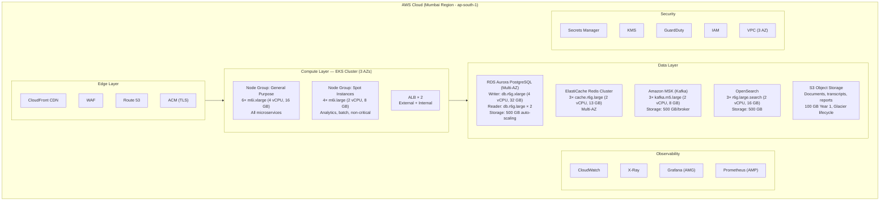

# Relationship Manager — Infrastructure & Cost Estimation (Non-AI Version)

> **Version:** 2.0 (Non-AI)
> **Date:** 2026-05-03
> **Status:** Proposed — Awaiting Review

---

## Table of Contents

1. [Capacity Planning Assumptions](#1-capacity-planning-assumptions)
2. [Infrastructure Components](#2-infrastructure-components)
3. [Compute Sizing](#3-compute-sizing)
4. [Data Storage Sizing](#4-data-storage-sizing)
5. [Network & CDN](#5-network--cdn)
6. [Third-Party Service Costs](#6-third-party-service-costs)
7. [Cost Summary](#7-cost-summary)
8. [Elastic Scaling Strategy](#8-elastic-scaling-strategy)
9. [Cost Optimization Recommendations](#9-cost-optimization-recommendations)

---

## 1. Capacity Planning Assumptions

### 1.1 User Base

| Metric | Value | Notes |
|---|---|---|
| **Total Registered Users** | 500,000 | Year 1 target |
| **Daily Active Users (Normal)** | 70,000 | Base DAU |
| **Daily Active Users (Peak)** | 100,000 | Upper threshold |
| **Elastic Max DAU** | 200,000 | Designed to handle 2× peak |
| **New Registrations/Day** | 1,000–2,000 | Growth phase |

### 1.2 Traffic Patterns

| Metric | Value | Calculation |
|---|---|---|
| **Peak Concurrent Users** | 15,000 | ~15% of peak DAU online simultaneously |
| **Conversations/Day** | 100,000 | Mix of new and follow-up |
| **Messages/Day** | 2,000,000 | Avg 20 messages per conversation |
| **API Requests/Day** | 10,000,000 | Messages + dashboard + profile + misc |
| **Peak API RPS** | 300 | 80% of traffic in 8-hour business window |
| **WebSocket Connections (Peak)** | 15,000 | Concurrent active chats |
| **Notifications/Day** | 200,000 | Reminders + confirmations + recommendations |

### 1.3 Data Growth

| Data Type | Daily Growth | Monthly Growth | Annual Growth |
|---|---|---|---|
| **Conversation Data** | ~500 MB | ~15 GB | ~180 GB |
| **Customer Profiles** | ~50 MB | ~1.5 GB | ~18 GB |
| **Notifications Log** | ~100 MB | ~3 GB | ~36 GB |
| **Analytics/Events** | ~1 GB | ~30 GB | ~360 GB |
| **Documents (KYC, Reports)** | ~200 MB | ~6 GB | ~72 GB |
| **Total** | **~1.85 GB/day** | **~55.5 GB/mo** | **~666 GB/yr** |

---

## 2. Infrastructure Components

### 2.1 AWS Infrastructure Map



---

## 3. Compute Sizing

### 3.1 EKS Cluster — Node Groups

| Node Group | Instance | Count | vCPU Total | RAM Total | Purpose | Pricing |
|---|---|---|---|---|---|---|
| **General** | m6i.xlarge | 6 | 24 | 96 GB | Microservices | On-Demand |
| **Spot** | m6i.large | 4 | 8 | 32 GB | Analytics, batch | Spot (~60% off) |
| **Total Base** | — | **10** | **32** | **128 GB** | — | — |

> **Note**: No GPU or ML-specific node groups needed — all processing is deterministic and runs on standard compute nodes.

### 3.2 Pod Resource Allocation

| Service | Min Pods | Max Pods (HPA) | CPU Request | Memory Request | Total Base CPU | Total Base Memory |
|---|---|---|---|---|---|---|
| API Gateway (Kong) | 2 | 6 | 500m | 512 MB | 1.0 | 1 GB |
| Auth Service | 2 | 4 | 250m | 512 MB | 0.5 | 1 GB |
| Conversation Service | 4 | 12 | 1000m | 1 GB | 4.0 | 4 GB |
| Customer Profile Svc | 3 | 8 | 500m | 512 MB | 1.5 | 1.5 GB |
| Risk Profiling Svc | 2 | 6 | 250m | 512 MB | 0.5 | 1 GB |
| Product Catalog Svc | 2 | 4 | 250m | 512 MB | 0.5 | 1 GB |
| Recommendation Svc | 2 | 6 | 250m | 512 MB | 0.5 | 1 GB |
| Wealth Projection Svc | 2 | 4 | 250m | 512 MB | 0.5 | 1 GB |
| Follow-Up Orchestrator | 2 | 4 | 500m | 512 MB | 1.0 | 1 GB |
| Notification Svc | 3 | 8 | 500m | 512 MB | 1.5 | 1.5 GB |
| Reminder Svc | 2 | 4 | 250m | 256 MB | 0.5 | 0.5 GB |
| Analytics Svc | 2 | 4 | 500m | 1 GB | 1.0 | 2 GB |
| Admin Svc | 1 | 2 | 250m | 512 MB | 0.25 | 0.5 GB |
| **Istio Sidecars** | — | — | 100m/pod | 128 MB/pod | ~3.0 | ~4 GB |
| **System (kube, monitoring)** | — | — | — | — | ~2.0 | ~4 GB |
| **TOTAL BASE** | **29** | **76** | — | — | **~18.75** | **~25.5 GB** |

**Headroom**: 32 vCPU available vs 18.75 used = **41% headroom** at base. Risk/Recommendation/Wealth services need less compute without ML inference.

### 3.3 Compute Cost Breakdown (Monthly)

| Component | Configuration | Unit Price | Monthly Cost |
|---|---|---|---|
| EKS Cluster | 1 cluster | $0.10/hr | **$73** |
| General Nodes | 6× m6i.xlarge (On-Demand) | $0.192/hr each | **$830** |
| Spot Nodes | 4× m6i.large (Spot ~$0.038/hr) | $0.038/hr each | **$110** |
| ALB | 2× ALB | ~$22/mo + LCU | **$100** |
| **Compute Total** | | | **~$1,113/mo** |

---

## 4. Data Storage Sizing

### 4.1 Database Sizing

#### Aurora PostgreSQL

| Metric | Value |
|---|---|
| **Writer Instance** | db.r6g.xlarge (4 vCPU, 32 GB RAM) |
| **Reader Instances** | 2× db.r6g.large (2 vCPU, 16 GB RAM) |
| **Storage (Year 1)** | ~250 GB (auto-scaling up to 128 TB) |
| **IOPS** | Included with Aurora (up to 200K) |
| **Connections** | ~500 (with connection pooling via PgBouncer) |

#### ElastiCache Redis

| Metric | Value |
|---|---|
| **Cluster** | 3× cache.r6g.large (13 GB each) |
| **Total Memory** | 39 GB |
| **Usage**: Sessions | ~5 GB (15K concurrent × 350 bytes avg) |
| **Usage**: Conversation Context | ~15 GB (active conversation state) |
| **Usage**: API Cache | ~5 GB |
| **Headroom** | ~14 GB (36%) |

#### Amazon MSK (Kafka)

| Metric | Value |
|---|---|
| **Brokers** | 3× kafka.m5.large |
| **Storage per Broker** | 500 GB |
| **Retention** | 7 days for most topics; 30 days for analytics |
| **Throughput** | ~50 MB/s (well within m5.large capacity) |
| **Topics** | ~10 |
| **Partitions** | 6-12 per topic |

#### OpenSearch

| Metric | Value |
|---|---|
| **Nodes** | 3× r6g.large.search |
| **Storage** | 500 GB total (EBS gp3) |
| **Indices** | Conversation logs, audit trails, analytics |
| **Retention** | Hot: 30 days, Warm: 90 days, Cold: 1 year |

### 4.2 Storage Cost Breakdown (Monthly)

| Component | Configuration | Monthly Cost |
|---|---|---|
| Aurora PostgreSQL Writer | db.r6g.xlarge | **$576** |
| Aurora PostgreSQL Readers | 2× db.r6g.large | **$461** |
| Aurora Storage | 250 GB @ $0.10/GB | **$25** |
| Aurora Backups | 250 GB | **$5** |
| ElastiCache Redis | 3× cache.r6g.large | **$474** |
| Amazon MSK | 3× kafka.m5.large + 1.5 TB storage | **$650** |
| OpenSearch | 3× r6g.large.search + 500 GB | **$540** |
| S3 | 100 GB + requests | **$5** |
| **Storage Total** | | **~$2,736/mo** |

---

## 5. Network & CDN

### 5.1 CloudFront CDN

| Metric | Value |
|---|---|
| **Requests/Month** | ~50M (static assets, API cache) |
| **Data Transfer** | ~500 GB/mo |
| **Origin** | S3 (static) + ALB (API) |
| **Edge Locations** | India-focused + global fallback |

### 5.2 Network Cost Breakdown (Monthly)

| Component | Configuration | Monthly Cost |
|---|---|---|
| CloudFront | 500 GB data + 50M requests | **$60** |
| Data Transfer (Inter-AZ) | ~200 GB | **$2** |
| Data Transfer (Internet) | ~500 GB | **$45** |
| NAT Gateway | 2× (Multi-AZ) + data | **$130** |
| Route 53 | Hosted zones + queries | **$5** |
| **Network Total** | | **~$242/mo** |

---

## 6. Third-Party Service Costs

### 6.1 Communication Providers

| Service | Volume/Month | Unit Price | Monthly Cost |
|---|---|---|---|
| **Twilio SMS** | 200K messages | $0.0075/msg (India) | **$1,500** |
| **WhatsApp Business API** | 150K conversations | $0.0042/msg (utility) | **$630** |
| **SendGrid Email** | 500K emails | Pro plan (100K/mo included) | **$90** |
| **Twilio Voice** | 5K minutes | $0.013/min (India) | **$65** |
| **Communication Total** | | | **~$2,285/mo** |

### 6.2 Monitoring & DevOps

| Service | Configuration | Monthly Cost |
|---|---|---|
| Grafana Cloud (AMG) | 1 workspace, 5 editors | **$0** (included in AWS) |
| Prometheus (AMP) | 5M samples/mo | **$50** |
| X-Ray Tracing | 5M traces/mo | **$25** |
| CloudWatch Logs | 50 GB/mo | **$25** |
| PagerDuty | Team plan, 5 users | **$100** |
| **Monitoring Total** | | **~$200/mo** |

### 6.3 Other Services

| Service | Configuration | Monthly Cost |
|---|---|---|
| Secrets Manager | 50 secrets | **$20** |
| KMS | 10K requests/mo | **$5** |
| ECR (Container Registry) | 20 images, 50 GB | **$5** |
| GitHub Actions | Team plan (included) | **$0** |
| **Other Total** | | **~$30/mo** |

---

## 7. Cost Summary

### 7.1 Monthly Cost Breakdown

| Category | Monthly Cost | % of Total |
|---|---|---|
| **Compute (EKS + ALB)** | $1,113 | 16.8% |
| **Data Storage (Aurora + Redis + Kafka + ES + S3)** | $2,736 | 41.3% |
| **Network & CDN** | $242 | 3.7% |
| **Communication (SMS + WhatsApp + Email + Voice)** | $2,285 | 34.5% |
| **Monitoring & DevOps** | $200 | 3.0% |
| **Other (Secrets, KMS, ECR)** | $30 | 0.5% |
| **Subtotal** | **$6,606** | |
| **Contingency (15%)** | $991 | |
| **TOTAL MONTHLY** | **~$7,597** | |
| **TOTAL ANNUAL** | **~$91,168** | |

> **Savings vs AI Version**: Removing AI/ML infrastructure (LLM APIs, SageMaker, Vector DB) saves **~$4,796/mo ($57,552/yr)** — a **42% reduction** in total monthly cost.

### 7.2 Cost Per User Metrics

| Metric | Value |
|---|---|
| **Cost per Registered User/Month** | $0.015 |
| **Cost per DAU/Month** | $0.109 (at 70K DAU) |
| **Cost per Conversation** | $0.076 |
| **Cost per Message** | $0.0038 |

### 7.3 Year 1 Total Cost of Ownership (TCO)

| Category | Annual Cost |
|---|---|
| **Infrastructure (AWS)** | $49,454 |
| **Communication Services** | $27,420 |
| **Monitoring & DevOps** | $2,760 |
| **Contingency (15%)** | $11,945 |
| **TOTAL YEAR 1** | **~$91,579** |

> **Note**: This excludes development team costs, licensing, and one-time setup fees. Compared to the AI version (~$157K/yr), the non-AI version saves ~$66K/yr.

### 7.4 Cost at Scale (200K DAU)

If traffic doubles to 200K DAU:

| Category | Base (70-100K DAU) | Scaled (200K DAU) | Scaling Factor |
|---|---|---|---|
| **Compute** | $1,113 | $2,500 | 2.2× (HPA + new nodes) |
| **Data Storage** | $2,736 | $4,100 | 1.5× (read replicas + storage) |
| **Network** | $242 | $450 | 1.9× |
| **Communication** | $2,285 | $4,600 | 2.0× (linear with notifications) |
| **Monitoring** | $200 | $300 | 1.5× |
| **TOTAL** | **$7,597** | **$14,400** | **~1.9×** |

---

## 8. Elastic Scaling Strategy

### 8.1 Horizontal Pod Autoscaler (HPA) Configuration

```yaml
# Example HPA for Conversation Service
apiVersion: autoscaling/v2
kind: HorizontalPodAutoscaler
metadata:
  name: conversation-service-hpa
  namespace: rm-production
spec:
  scaleTargetRef:
    apiVersion: apps/v1
    kind: Deployment
    name: conversation-service
  minReplicas: 4
  maxReplicas: 12
  metrics:
    - type: Resource
      resource:
        name: cpu
        target:
          type: Utilization
          averageUtilization: 70
    - type: Resource
      resource:
        name: memory
        target:
          type: Utilization
          averageUtilization: 75
    - type: Pods
      pods:
        metric:
          name: websocket_connections
        target:
          type: AverageValue
          averageValue: "3000"    # Scale if > 3000 WS connections per pod
  behavior:
    scaleUp:
      stabilizationWindowSeconds: 60
      policies:
        - type: Pods
          value: 2
          periodSeconds: 60
    scaleDown:
      stabilizationWindowSeconds: 300
      policies:
        - type: Pods
          value: 1
          periodSeconds: 120
```

### 8.2 Cluster Autoscaler Configuration

```yaml
# Cluster Autoscaler for EKS
apiVersion: autoscaling.k8s.io/v1
kind: ClusterAutoscaler
metadata:
  name: rm-cluster-autoscaler
spec:
  nodeGroups:
    - name: general-purpose
      minSize: 4
      maxSize: 12
      instanceType: m6i.xlarge
      labels:
        workload-type: general
    - name: spot-instances
      minSize: 2
      maxSize: 8
      instanceType: m6i.large
      spotPrice: "0.05"
      labels:
        workload-type: batch
  scaleDown:
    enabled: true
    delayAfterAdd: 10m
    delayAfterDelete: 1m
    unneededTime: 5m
```

### 8.3 Database Scaling Strategy

```
AURORA POSTGRESQL:
  - Auto-scaling storage (10 GB → 128 TB)
  - Add read replicas automatically when CPU > 70%
    - Current: 1 Writer + 2 Readers
    - Max: 1 Writer + 15 Readers
  - Aurora Serverless v2 as alternative for unpredictable workloads

REDIS:
  - Cluster mode with resharding support
  - Add shards when memory > 75%
  - Current: 3 nodes, Max: 15 nodes

KAFKA:
  - Add partitions to topics (no data loss)
  - Add brokers: Current 3, Max 12
  - Storage auto-scaling on MSK
```

### 8.4 Scaling Decision Matrix

| Traffic Level | DAU | EKS Nodes | DB Readers | Redis Nodes | Kafka Brokers | Est. Monthly Cost |
|---|---|---|---|---|---|---|
| **Low** | < 50K | 6+2 | 1 | 3 | 3 | ~$5,500 |
| **Normal** | 70K | 6+4 | 2 | 3 | 3 | ~$7,600 |
| **Peak** | 100K | 8+4 | 3 | 3 | 3 | ~$9,500 |
| **High** | 150K | 10+6 | 4 | 4 | 4 | ~$12,000 |
| **Max Elastic** | 200K | 12+8 | 5 | 5 | 5 | ~$14,400 |

---

## 9. Cost Optimization Recommendations

### 9.1 Reserved Instances / Savings Plans

| Resource | Commitment | Savings |
|---|---|---|
| **EKS Nodes (General)** | 1-year Compute Savings Plan | ~30% ($250/mo saved) |
| **Aurora PostgreSQL** | 1-year Reserved Instance | ~35% ($370/mo saved) |
| **ElastiCache Redis** | 1-year Reserved Nodes | ~35% ($166/mo saved) |
| **Total Annual Savings** | | **~$9,432/year** |

### 9.2 Communication Cost Optimization

| Strategy | Potential Savings |
|---|---|
| **Template-based WhatsApp** | Use utility templates (cheaper than marketing) |
| **Email over SMS** | Shift non-urgent reminders to email (90% cheaper) |
| **Batch Notifications** | Combine multiple notifications into daily digests |
| **Channel Fallback** | Push notification first (free), then SMS/WhatsApp |

### 9.3 Optimized Cost Projection

| Scenario | Monthly Cost | Annual Cost |
|---|---|---|
| **Base (no optimization)** | $7,597 | $91,168 |
| **With Reserved Instances** | $6,811 | $81,736 |
| **With Communication Optimization** | $5,811 | **$69,736** |
| **Fully Optimized** | **~$5,800** | **~$69,600** |

### 9.4 Growth Cost Projection (Years 1-3)

| Year | Users | DAU | Monthly Cost (Optimized) | Annual Cost |
|---|---|---|---|---|
| **Year 1** | 500K | 70-100K | $5,800 - $7,600 | $69,600 - $91,200 |
| **Year 2** | 1M | 140-200K | $10,500 - $14,400 | $126,000 - $172,800 |
| **Year 3** | 2M | 280-400K | $19,000 - $26,000 | $228,000 - $312,000 |

> **Note**: Years 2 and 3 assume linear cost scaling, but economies of scale and optimization should reduce the actual ratio. Reserved Instance savings increase with larger commitments.

---

## Appendix A: Region Selection Rationale

**Primary Region: ap-south-1 (Mumbai)**
- Lowest latency for India-based customer base
- All required services available
- Data residency compliance (RBI guidelines)

**DR Region: ap-south-2 (Hyderabad)**
- Secondary region for disaster recovery
- Cross-region replication for Aurora, S3, and Redis
- Adds ~15% to infrastructure cost for DR

## Appendix B: Environment Matrix

| Environment | Purpose | Scale | Monthly Cost |
|---|---|---|---|
| **Production** | Live customer-facing | Full | $7,597 |
| **Staging** | Pre-production testing | 25% of prod | ~$1,899 |
| **Development** | Developer environments | 10% of prod | ~$760 |
| **Total All Environments** | | | **~$10,256** |

## Appendix C: AI vs Non-AI Cost Comparison

| Category | AI Version | Non-AI Version | Savings |
|---|---|---|---|
| **Compute** | $1,113 | $1,113 | $0 |
| **Data Storage** | $2,736 | $2,736 | $0 |
| **Network** | $242 | $242 | $0 |
| **AI/ML (LLM + ML Hosting)** | $4,796 | $0 | **$4,796** |
| **Communication** | $2,285 | $2,285 | $0 |
| **Monitoring** | $200 | $200 | $0 |
| **Other** | $30 | $30 | $0 |
| **TOTAL (with contingency)** | **$13,112** | **$7,597** | **$5,515 (42%)** |

---

*This document should be reviewed alongside the [Architecture Document](./01-architecture-document.md), [High-Level Design](./02-high-level-design.md), and [Low-Level Design](./03-low-level-design.md).*
