# Relationship Manager — Sequence Diagrams (Non-AI Version)

> **Version:** 2.0 (Non-AI)
> **Date:** 2026-05-03
> **Status:** Proposed — Awaiting Review

---

## Table of Contents

1. [UC-01: Anonymous Customer Starts a Conversation](#uc-01-anonymous-customer-starts-a-conversation)
2. [UC-02: Conversational Data Collection (Personal Details)](#uc-02-conversational-data-collection-personal-details)
3. [UC-03: Financial Profile Collection](#uc-03-financial-profile-collection)
4. [UC-04: Retirement Goal Capture](#uc-04-retirement-goal-capture)
5. [UC-05: Risk Profile Assessment](#uc-05-risk-profile-assessment)
6. [UC-06: Product Recommendation & Wealth Projection](#uc-06-product-recommendation--wealth-projection)
7. [UC-07: Communication Channel Preference Selection](#uc-07-communication-channel-preference-selection)
8. [UC-08: Follow-Up Scheduling](#uc-08-follow-up-scheduling)
9. [UC-09: Anonymous-to-Authenticated Session Conversion](#uc-09-anonymous-to-authenticated-session-conversion)
10. [UC-10: Follow-Up Reminder Delivery (Multi-Channel)](#uc-10-follow-up-reminder-delivery-multi-channel)
11. [UC-11: Follow-Up Conversation Execution](#uc-11-follow-up-conversation-execution)
12. [UC-12: Human RM Handoff](#uc-12-human-rm-handoff)
13. [UC-13: WhatsApp Inbound Follow-Up Interaction](#uc-13-whatsapp-inbound-follow-up-interaction)
14. [UC-14: Wealth Projection Recalculation](#uc-14-wealth-projection-recalculation)
15. [UC-15: Periodic Risk Profile Refresh](#uc-15-periodic-risk-profile-refresh)
16. [UC-16: Customer Dashboard Data Load](#uc-16-customer-dashboard-data-load)
17. [UC-17: Admin Product Catalog Update](#uc-17-admin-product-catalog-update)
18. [UC-18: Conversation Resumption (Paused Session)](#uc-18-conversation-resumption-paused-session)
19. [UC-19: Input Parse Failure & Graceful Recovery](#uc-19-input-parse-failure--graceful-recovery)
20. [UC-20: End-to-End New Customer Journey (Complete Flow)](#uc-20-end-to-end-new-customer-journey-complete-flow)

---

## UC-01: Anonymous Customer Starts a Conversation

A new visitor lands on the platform and starts a conversation without logging in.

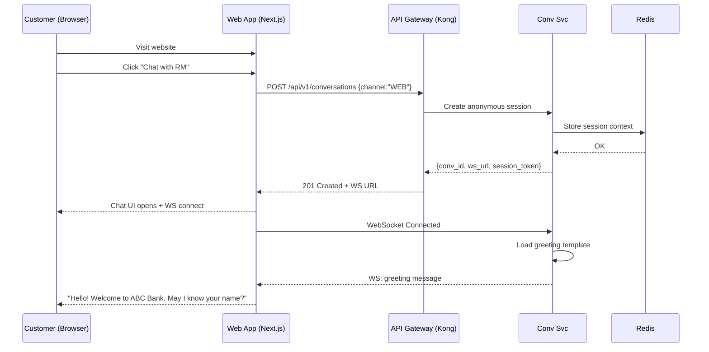

---

## UC-02: Conversational Data Collection (Personal Details)

The system collects customer name, age group, location, phone, and email through guided conversation.

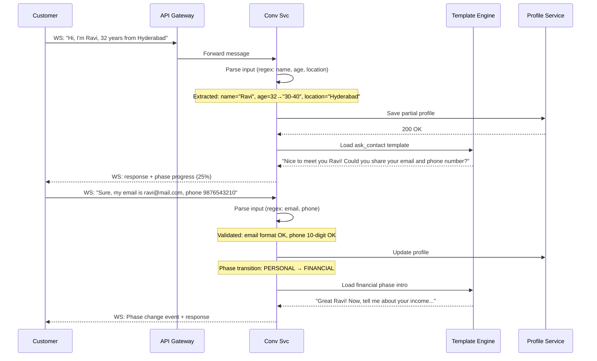

---

## UC-03: Financial Profile Collection

The system collects income source, income range, current investments, and savings.

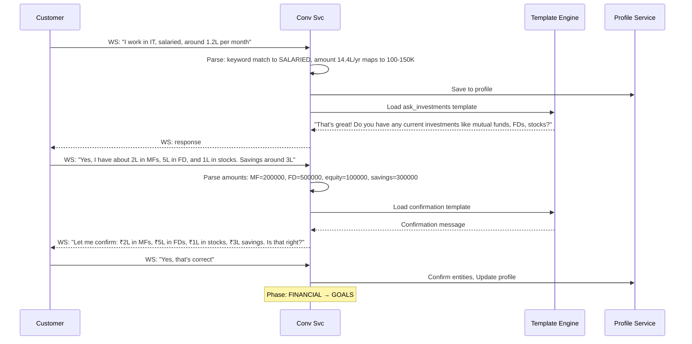

---

## UC-04: Retirement Goal Capture

The system collects retirement target amount and target age based on customer's age group.

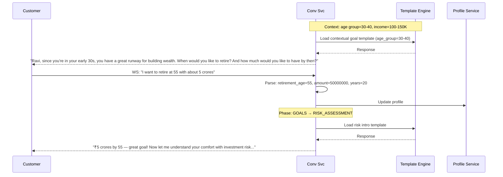

---

## UC-05: Risk Profile Assessment

The system computes a risk score using weighted scoring and presents the result to the customer.

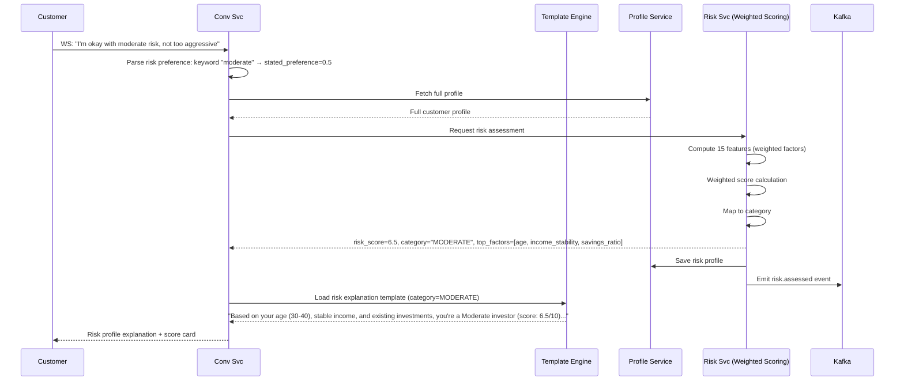

---

## UC-06: Product Recommendation & Wealth Projection

The recommendation engine builds a portfolio and the wealth projection engine calculates growth.

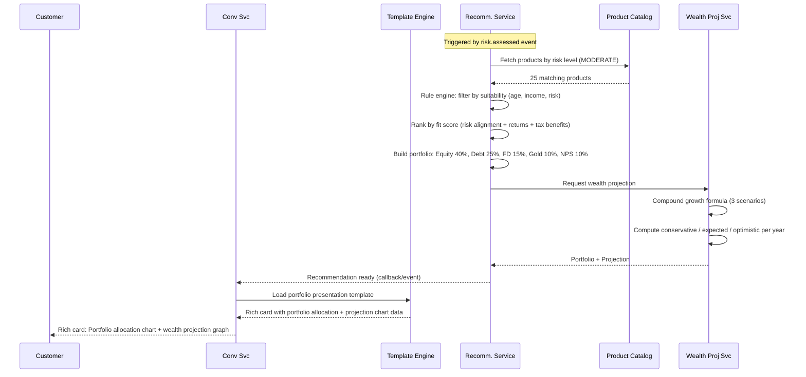

---

## UC-07: Communication Channel Preference Selection

Customer selects their preferred channel for follow-up communications.

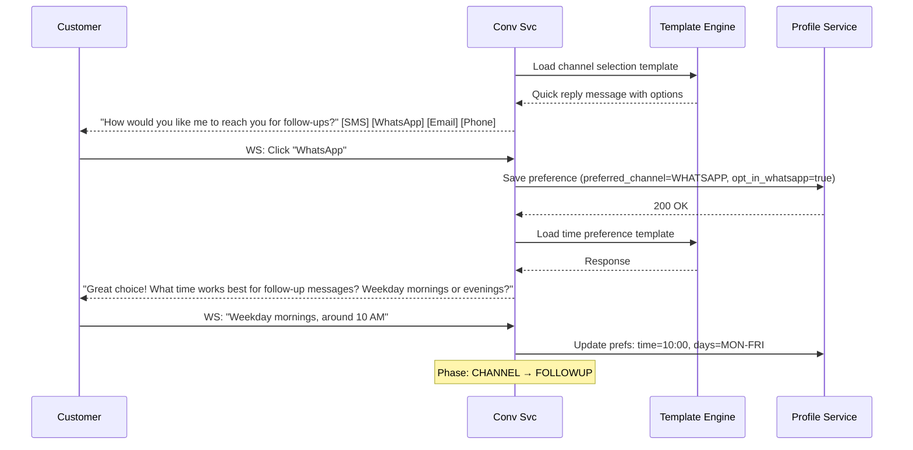

---

## UC-08: Follow-Up Scheduling

The system creates a follow-up schedule and confirms with the customer.

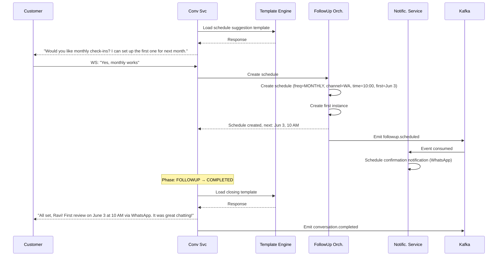

---

## UC-09: Anonymous-to-Authenticated Session Conversion

An anonymous user decides to register, and all data migrates seamlessly.

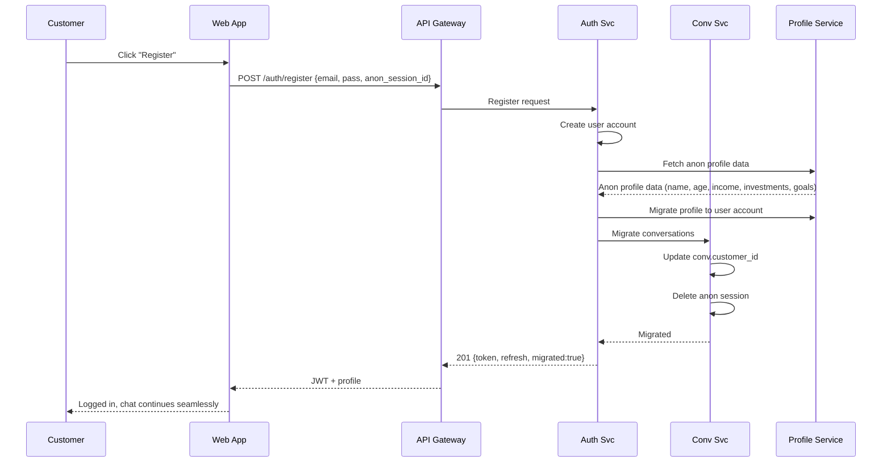

---

## UC-10: Follow-Up Reminder Delivery (Multi-Channel)

The reminder service triggers a notification 24 hours before a scheduled follow-up.

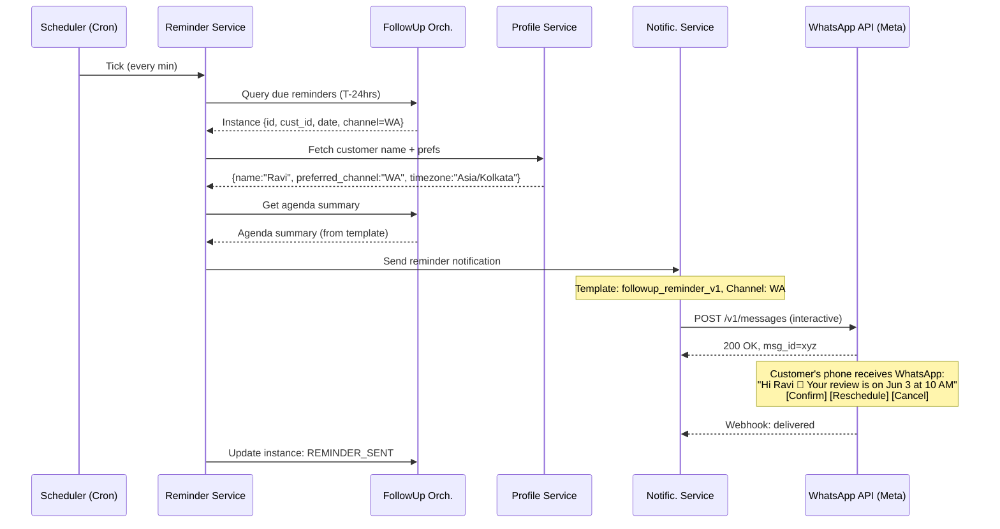

---

## UC-11: Follow-Up Conversation Execution

A scheduled follow-up begins with a template-generated agenda from previous context.

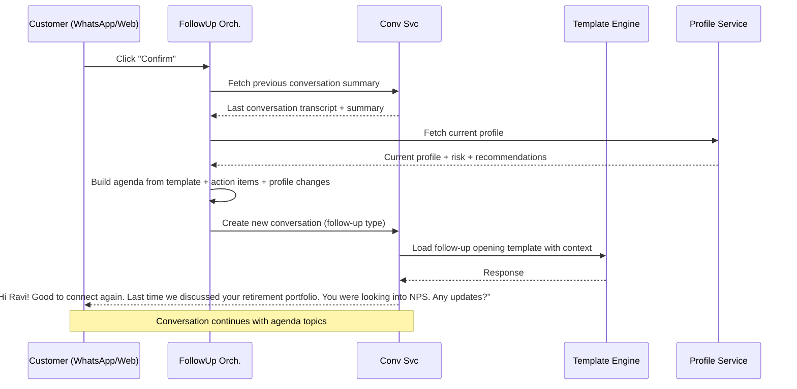

---

## UC-12: Human RM Handoff

When input cannot be parsed after 2 attempts or customer explicitly requests a human.

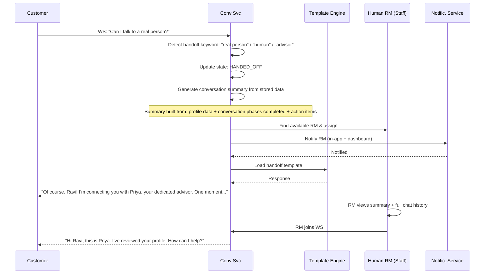

---

## UC-13: WhatsApp Inbound Follow-Up Interaction

Customer responds to a follow-up via WhatsApp, triggering a structured conversation.

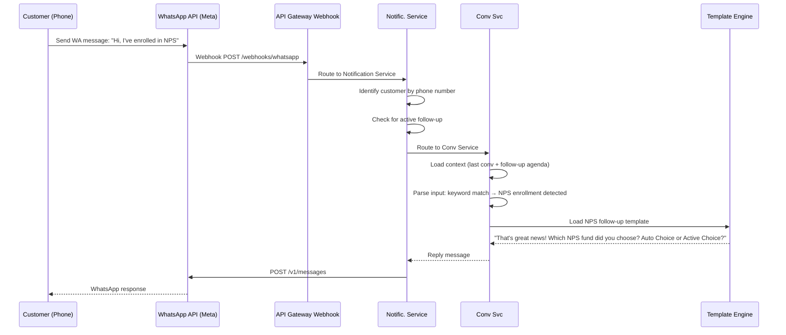

---

## UC-14: Wealth Projection Recalculation

Customer updates their investments, triggering a new projection.

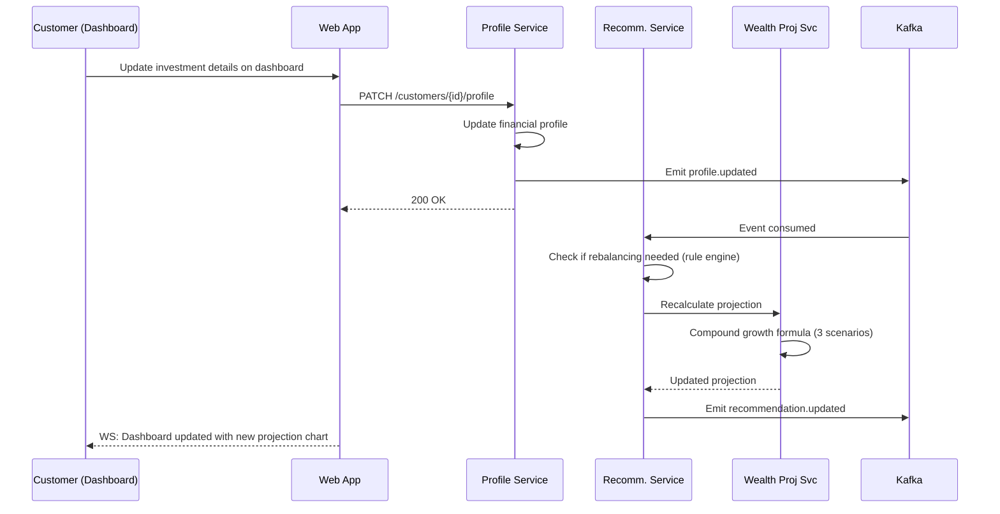

---

## UC-15: Periodic Risk Profile Refresh

The system periodically re-assesses customer risk profiles.

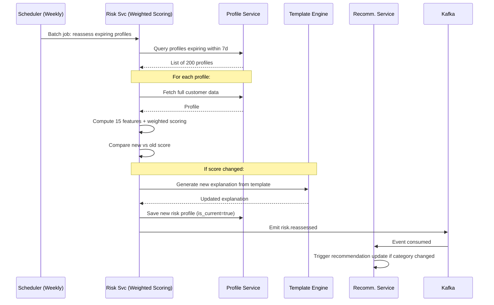

---

## UC-16: Customer Dashboard Data Load

Customer views their dashboard with portfolio, projection, and upcoming follow-ups.

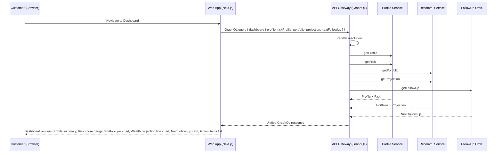

---

## UC-17: Admin Product Catalog Update

Bank admin adds or updates products in the catalog.

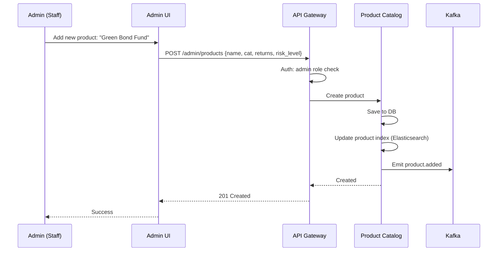

---

## UC-18: Conversation Resumption (Paused Session)

Customer returns to a previously paused conversation.

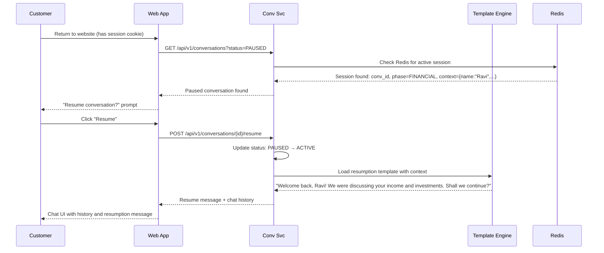

---

## UC-19: Input Parse Failure & Graceful Recovery

When the system cannot parse customer input, it falls back to structured options.

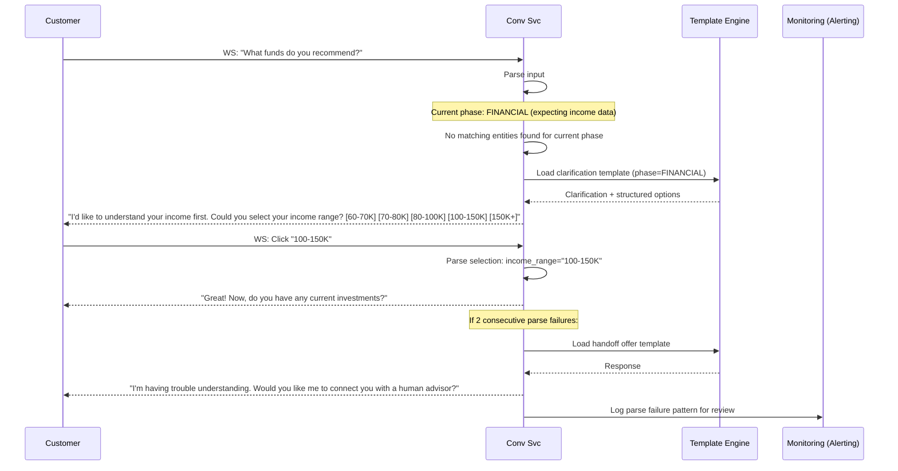

---

## UC-20: End-to-End New Customer Journey (Complete Flow)

Complete journey from anonymous visit to scheduled follow-up.

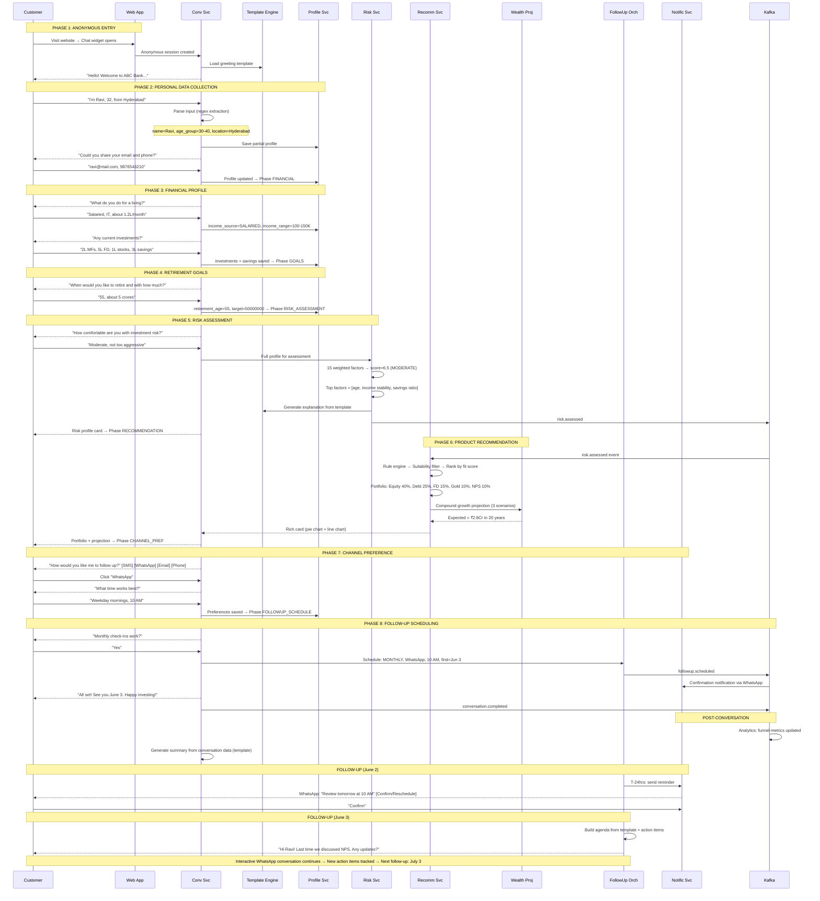

---

*These sequence diagrams complement the [Architecture Document](./01-architecture-document.md), [High-Level Design](./02-high-level-design.md), and [Low-Level Design](./03-low-level-design.md).*
