# Use Case Diagram — RealWorld (Conduit) Application

## Use Case Diagram (Mermaid)

```mermaid
flowchart LR
    %% Actors
    AnonymousUser(["Anonymous User"])
    AuthenticatedUser(["Authenticated User"])

    %% Authentication Use Cases
    subgraph Authentication
        UC_Register["Register"]
        UC_Login["Login"]
        UC_Logout["Logout"]
    end

    %% User Profile Use Cases
    subgraph User_Profile["User Profile"]
        UC_ViewProfile["View Profile"]
        UC_UpdateProfile["Update Profile"]
        UC_FollowUser["Follow User"]
        UC_UnfollowUser["Unfollow User"]
    end

    %% Article Use Cases
    subgraph Articles
        UC_ListArticles["List Articles"]
        UC_ViewArticle["View Article"]
        UC_CreateArticle["Create Article"]
        UC_UpdateArticle["Update Article"]
        UC_DeleteArticle["Delete Article"]
        UC_FavoriteArticle["Favorite Article"]
        UC_UnfavoriteArticle["Unfavorite Article"]
        UC_ViewFeed["View Personal Feed"]
        UC_FilterByTag["Filter Articles by Tag"]
    end

    %% Comment Use Cases
    subgraph Comments
        UC_ViewComments["View Comments"]
        UC_AddComment["Add Comment"]
        UC_DeleteComment["Delete Comment"]
    end

    %% Tag Use Cases
    subgraph Tags
        UC_ViewTags["View Tags"]
    end

    %% Anonymous User Associations
    AnonymousUser --> UC_Register
    AnonymousUser --> UC_Login
    AnonymousUser --> UC_ListArticles
    AnonymousUser --> UC_ViewArticle
    AnonymousUser --> UC_ViewProfile
    AnonymousUser --> UC_ViewComments
    AnonymousUser --> UC_ViewTags
    AnonymousUser --> UC_FilterByTag

    %% Authenticated User Associations
    AuthenticatedUser --> UC_Logout
    AuthenticatedUser --> UC_UpdateProfile
    AuthenticatedUser --> UC_FollowUser
    AuthenticatedUser --> UC_UnfollowUser
    AuthenticatedUser --> UC_CreateArticle
    AuthenticatedUser --> UC_UpdateArticle
    AuthenticatedUser --> UC_DeleteArticle
    AuthenticatedUser --> UC_FavoriteArticle
    AuthenticatedUser --> UC_UnfavoriteArticle
    AuthenticatedUser --> UC_ViewFeed
    AuthenticatedUser --> UC_AddComment
    AuthenticatedUser --> UC_DeleteComment

    %% Authenticated User inherits Anonymous User capabilities
    AuthenticatedUser --> UC_ListArticles
    AuthenticatedUser --> UC_ViewArticle
    AuthenticatedUser --> UC_ViewProfile
    AuthenticatedUser --> UC_ViewComments
    AuthenticatedUser --> UC_ViewTags
    AuthenticatedUser --> UC_FilterByTag
```

## Actors

| Actor | Description |
|-------|-------------|
| **Anonymous User** | A visitor who has not logged in. Can browse articles, view profiles, read comments, and view tags. Can register or log in to become an authenticated user. |
| **Authenticated User** | A registered user who has logged in with valid credentials. Inherits all Anonymous User capabilities and can additionally create/manage content and interact socially (follow, favorite, comment). |

> **Note:** This application does not implement a distinct Admin role. Content ownership is enforced via the `AuthorizationService` — only the author of an article or comment (or the article owner for comments) can modify/delete it.

## Use Cases

| # | Use Case | Description | Actors | API Endpoints |
|---|----------|-------------|--------|---------------|
| 1 | **Register** | Create a new user account with email, username, and password | Anonymous User | `POST /users` · GraphQL `createUser` |
| 2 | **Login** | Authenticate with email and password, receive a JWT token | Anonymous User | `POST /users/login` · GraphQL `login` |
| 3 | **Logout** | End the current session by discarding the JWT token (client-side) | Authenticated User | Frontend only (localStorage clear) |
| 4 | **View Profile** | View a user's public profile (username, bio, image, following status) | Anonymous User, Authenticated User | `GET /profiles/{username}` · GraphQL `profile` |
| 5 | **Update Profile** | Update current user's email, username, password, bio, or image | Authenticated User | `PUT /user` · GraphQL `updateUser` |
| 6 | **Follow User** | Follow another user to see their articles in your feed | Authenticated User | `POST /profiles/{username}/follow` · GraphQL `followUser` |
| 7 | **Unfollow User** | Stop following a user | Authenticated User | `DELETE /profiles/{username}/follow` · GraphQL `unfollowUser` |
| 8 | **List Articles** | Browse articles with optional filters (author, favorited by, tag) with pagination | Anonymous User, Authenticated User | `GET /articles` · GraphQL `articles` |
| 9 | **View Article** | Read a single article by its slug, including tags and metadata | Anonymous User, Authenticated User | `GET /articles/{slug}` · GraphQL `article` |
| 10 | **Create Article** | Publish a new article with title, description, body, and tags | Authenticated User | `POST /articles` · GraphQL `createArticle` |
| 11 | **Update Article** | Edit the title, description, or body of an owned article | Authenticated User | `PUT /articles/{slug}` · GraphQL `updateArticle` |
| 12 | **Delete Article** | Remove an owned article from the platform | Authenticated User | `DELETE /articles/{slug}` · GraphQL `deleteArticle` |
| 13 | **Favorite Article** | Mark an article as a favorite | Authenticated User | `POST /articles/{slug}/favorite` · GraphQL `favoriteArticle` |
| 14 | **Unfavorite Article** | Remove an article from favorites | Authenticated User | `DELETE /articles/{slug}/favorite` · GraphQL `unfavoriteArticle` |
| 15 | **View Personal Feed** | View articles from followed users (personalized feed) | Authenticated User | `GET /articles/feed` · GraphQL `feed` |
| 16 | **Filter Articles by Tag** | Filter the article list by a specific tag | Anonymous User, Authenticated User | `GET /articles?tag={tag}` · GraphQL `articles(withTag:)` |
| 17 | **View Comments** | View all comments on an article | Anonymous User, Authenticated User | `GET /articles/{slug}/comments` · GraphQL `article.comments` |
| 18 | **Add Comment** | Post a comment on an article | Authenticated User | `POST /articles/{slug}/comments` · GraphQL `addComment` |
| 19 | **Delete Comment** | Remove a comment (by comment author or article owner) | Authenticated User | `DELETE /articles/{slug}/comments/{id}` · GraphQL `deleteComment` |
| 20 | **View Tags** | Retrieve the list of all popular/available tags | Anonymous User, Authenticated User | `GET /tags` · GraphQL `tags` |

## Include / Extend Relationships

| Relationship | Type | Description |
|--------------|------|-------------|
| Login **includes** JWT Token Generation | `<<include>>` | Every successful login generates a JWT token via `JwtService.toToken()` which is returned to the client for subsequent authenticated requests. |
| Register **includes** JWT Token Generation | `<<include>>` | Upon successful registration, a JWT token is immediately issued so the user is logged in without a separate login step. |
| Create Article **includes** Slug Generation | `<<include>>` | When an article is created, a URL-friendly slug is automatically generated from the title (`Article.toSlug()`). |
| Update Article **extends** Slug Generation | `<<extends>>` | If the article title is updated, the slug is regenerated to match the new title. |
| View Personal Feed **includes** Login | `<<include>>` | Accessing the personal feed requires authentication; the security configuration (`WebSecurityConfig`) enforces this at the endpoint level. |
| Delete Comment **extends** Delete Article | `<<extends>>` | Article owners have the extended ability to delete any comment on their article, not just their own comments (`AuthorizationService.canWriteComment`). |
| Follow User **includes** View Personal Feed | `<<include>>` | Following a user causes their articles to appear in the authenticated user's personal feed. The feed is composed from the follow relations. |
| Filter Articles by Tag **extends** List Articles | `<<extends>>` | Tag filtering is an optional extension of the List Articles use case, applied via the `tag` query parameter. |

## Domain Entities

| Entity | Description | Key Attributes |
|--------|-------------|----------------|
| **User** | Registered platform user | id, email, username, password (hashed), bio, image |
| **Article** | Blog post/article published by a user | id, slug, title, description, body, tags, userId, createdAt, updatedAt |
| **Comment** | Text comment on an article | id, body, userId, articleId, createdAt |
| **Tag** | Label attached to articles for categorization | id, name |
| **ArticleFavorite** | Join record linking a user to a favorited article | articleId, userId |
| **FollowRelation** | Social graph edge — one user follows another | userId, targetId |

## API Layer Summary

This application exposes **two parallel API layers** for the same business logic:

1. **REST API** (`src/main/java/io/spring/api/`) — Traditional RESTful endpoints following the [RealWorld API spec](https://realworld-docs.netlify.app/docs/specs/backend-specs/endpoints)
2. **GraphQL API** (`src/main/java/io/spring/graphql/`) — Netflix DGS framework implementation with relay-style cursor pagination

Both layers share the same domain core (`src/main/java/io/spring/core/`) and application services (`src/main/java/io/spring/application/`).

## Security Model

- **Authentication**: Stateless JWT (HS512) via `Authorization: Token <jwt>` header
- **Authorization**: Owner-based — users can only modify their own articles and comments; article owners can also delete comments on their articles
- **Public endpoints**: `GET /articles/**`, `GET /profiles/**`, `GET /tags`, `POST /users`, `POST /users/login`, `/graphql`
- **Protected endpoints**: All other REST endpoints require a valid JWT token
